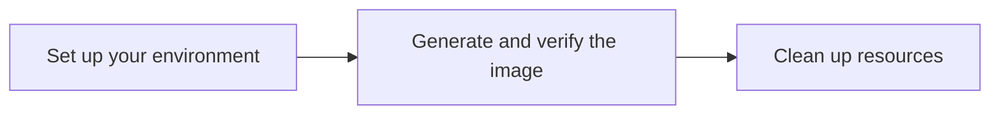

# Quickstart: Generate and verify an image's watermark using Imagen text-to-image (Console)

This quickstart shows you how to use Imagen on Vertex AI to generate images from a text prompt and how to verify the digital watermark ([SynthID](https://deepmind.google/technologies/synthid/)) on a generated image. All steps are performed in the Google Cloud console.

For information on pricing for the features you use, see [Imagen on Vertex AI pricing](https://cloud.google.com/vertex-ai/pricing#generative_ai_models).

<figure style="text-align: center;">
  
  <figcaption>Image generated using Imagen on Vertex AI from the prompt: <em>portrait of a french bulldog at the beach, 85mm f/2.8</em>.</figcaption>
</figure>

This tutorial follows the workflow below:



## 📚 Before you begin
<a name="before-you-begin"></a>

???+ "Before you begin"

    1.  **Sign in to your Google Cloud account.** If you're new to Google Cloud, [create an account](https://console.cloud.google.com/freetrial) to evaluate how our products perform in real-world scenarios. New customers also get $300 in free credits to run, test, and deploy workloads.

    2.  **Select or create a Google Cloud project.** In the Google Cloud console, on the project selector page, select or create a Google Cloud project.

        !!! note
            If you don't plan to keep the resources that you create in this procedure, create a new project instead of selecting an existing one. After you finish, you can delete the project, removing all associated resources.

        [Go to project selector](https://console.cloud.google.com/projectselector2/home/dashboard){: .md-button}

    3.  **Enable billing for your project.** [Make sure that billing is enabled for your Google Cloud project](/billing/docs/how-to/verify-billing-enabled#confirm_billing_is_enabled_on_a_project).

    4.  **Enable the Vertex AI API.**

        [Enable the API](https://console.cloud.google.com/flows/enableapi?apiid=aiplatform.googleapis.com){: .md-button}

## ⚙️ Generate and verify an image's watermark
<a name="generate-and-verify-an-images-watermark"></a>

???+ "Step-by-step guide"

    **Generate images and save a local copy**

    1.  In the Google Cloud console, open the **Vertex AI Studio > Media** tab.

        [Go to Vertex AI Studio](https://console.cloud.google.com/vertex-ai/studio/media/generate;tab=image){: .md-button}

    2.  In the **Prompt** field, enter the following description:
        ```
        portrait of a french bulldog at the beach, 85mm f/2.8
        ```

    3.  In the **Parameters** panel, under **Model options**, select `Imagen 3`.

    4.  In the **Aspect ratio** section, select `1:1`.

    5.  In the **Number of results** section, change the value to `2`.

    6.  Click play_arrow**Generate**. Your results will look similar to the following images:

        <figure style="text-align: center;">
          
          <figcaption>Sample generated images.</figcaption>
        </figure>

    7.  To save a local copy of an image, click one of the generated images.

    8.  In the **Image details** window that opens, click **Export**.

    9.  In the **Export image** dialog box, click **Export** to download the image.

    **Verify an image's digital watermark**

    After you generate and save a watermarked image, you can verify its digital watermark.

    1.  With the **Image details** window still open from the previous step, click local_police**Verify**.

    2.  Click **Upload image**.

    3.  Select the generated image that you saved locally. The tool will analyze the image and report whether a digital watermark is detected.

        <figure style="text-align: center;">
          
          <figcaption>A verified digital watermark.</figcaption>
        </figure>

    Congratulations! You've used the Imagen text-to-image feature to create novel images and verify the digital watermark of one of the images.

!!! tip "Troubleshooting"
    If you encounter issues with code snippets or setup, refer to the [Troubleshooting Guide](https://cloud.google.com/vertex-ai/docs/general/troubleshooting?component=any).

## ⚙️ Clean up
<a name="clean-up"></a>

To avoid incurring charges to your Google Cloud account for the resources used on this page, delete the project that you created.

??? "Steps for cleaning up resources"

    !!! caution "Deleting a project has the following effects:"
        *   **Everything in the project is deleted.** If you used an existing project, you also delete any other work you've done in it.
        *   **Custom project IDs are lost.** When you created this project, you might have created a custom project ID that you want to use in the future. To preserve URLs that use the project ID, such as an `appspot.com` URL, delete selected resources inside the project instead of deleting the whole project.

    If you plan to explore multiple quickstarts and tutorials, reusing projects can help you avoid exceeding project quota limits.

    1.  In the Google Cloud console, go to the **Manage resources** page.

        [Go to Manage resources](https://console.cloud.google.com/iam-admin/projects){: .md-button}

    2.  In the project list, select the project that you want to delete, and then click **Delete**.
    3.  In the dialog, type the project ID, and then click **Shut down** to delete the project.

## 🔗 What's next

*   Learn about all image generative AI features in the [Imagen on Vertex AI overview](/vertex-ai/docs/generative-ai/image/overview).
*   To view an overview of the API options for image generation and editing, see the [`imagegeneration` model API reference](https://cloud.google.com/vertex-ai/docs/generative-ai/model-reference/image-generation).
*   Read [usage guidelines for Imagen on Vertex AI](/vertex-ai/docs/generative-ai/image/image-guidelines).
*   Explore more pretrained models in [Model Garden](/vertex-ai/docs/start/explore-models).
*   Learn about [responsible AI best practices and Vertex AI's safety filters](/vertex-ai/docs/generative-ai/learn/responsible-ai).