# Migrate your application to Gemini 2 with the Gemini API in Vertex AI

This guide shows how to migrate generative AI applications from Gemini 1.x and PaLM models to Gemini 2 models.

## 📚 Why migrate to Gemini 2?

Gemini 2 delivers significant performance improvements over Gemini 1.x and PaLM models, along with new capabilities. Additionally, each model version has its own [version support and availability timeline](learn/model-versions.md).

Upgrading most generative AI applications to Gemini 2 shouldn't require significant reengineering of prompts or code. However, some applications might require prompt changes, which are difficult to predict without testing. Therefore, we recommend testing your application with Gemini 2 before migrating.

Significant code changes are only needed to address certain breaking changes or to use new Gemini 2 capabilities.

## 📚 Which Gemini 2 model should I migrate to?

When choosing a Gemini 2 model, consider the features your application requires and their associated costs.

For an overview of Gemini 2 model features, see [Gemini 2](https://cloud.google.com/vertex-ai/generative-ai/docs/gemini/gemini-2-overview). For an overview of all Google models, see [Google models](https://cloud.google.com/vertex-ai/generative-ai/docs/learn/models).

The following table provides a comparison of Gemini 1.x and Gemini 2 models.

| Feature | Gemini 1.5 Pro | Gemini 1.5 Flash | Gemini 2.0 Flash | Gemini 2.0 Flash-Lite | Gemini 2.5 Pro | Gemini 2.5 Flash |
|---|---|---|---|---|---|---|
| **Input modalities** | text, documents, image, video, audio | text, documents, image, video, audio | text, documents, image, video, audio | text, documents, image, video, audio | text, documents, image, video, audio | text, documents, image, video, audio |
| **Output modalities** | text | text | text | text | text | text |
| **Context window, total token limit** | 2,097,152 | 1,048,576 | 1,048,576 | 1,048,576 | 1,048,576 | 1,048,576 |
| **Output context length** | 8,192 | 8,192 | 8,192 | 8,192 | 64,192 | 64,192 |
| **Grounding with Search** | Yes | Yes | Yes | No | Yes | Yes |
| **Function calling** | Yes | Yes | Yes | Yes | Yes | Yes |
| **Code execution** | No | No | Yes | No | Yes | Yes |
| **Context caching** | Yes | Yes | Yes | No | Yes | Yes |
| **Batch prediction** | Yes | Yes | Yes | Yes | Yes | Yes |
| **Live API** | No | No | No | No | No | No |
| **Latency** | Most capable in 1.5 family | Fastest in 1.5 family | Fast + good cost efficiency | Fast + most cost efficient | Slower than Flash, but good cost efficiency | Fast + most cost efficient |
| **Fine-tuning** | Yes | Yes | Yes | Yes | Yes | Yes |
| **Recommended SDK** | Vertex AI SDK | Vertex AI SDK | Gen AI SDK | Gen AI SDK | Gen AI SDK | Gen AI SDK |
| **Pricing units** | Character | Character | Token | Token | Token | Token |

## ⚙️ Before you begin
<a name="before-you-begin"></a>

???+ "Prerequisites for a seamless migration"

    For a seamless Gemini 2 migration, we recommend that you address the following concerns before you begin the migration process.

    *   **Model retirement awareness**: Note the [model version support and availability timelines](learn/model-versions.md) for older Gemini models, and make sure your migration is completed before the model you're using is retired.

    *   **InfoSec, governance, and regulatory approvals**: Proactively request the approvals you need for Gemini 2 from your information security (InfoSec), risk, and compliance stakeholders. Make sure that you cover domain-specific risk and compliance constraints, especially in heavily regulated industries such as healthcare and financial services. Note that Gemini security controls differ among Gemini 2 models.

    *   **Location availability**: See the [Generative AI on Google Cloud models and partner model availability](https://cloud.google.com/vertex-ai/generative-ai/docs/learn/models#available-regions) documentation, and make sure your chosen Gemini 2 model is available in the regions where you need it, or consider switching to the global endpoint.

    *   **Modality and tokenization-based pricing differences**: Check Gemini 2 pricing for all the modalities (text, code, images, speech) in your application. For more information, see the [generative AI pricing page](https://cloud.google.com/vertex-ai/generative-ai/pricing). Note that Gemini 2 text input and output is priced per token, while Gemini 1 text input and output is priced per character.

    *   **Provisioned Throughput**: If needed, [purchase additional Provisioned Throughput](provisioned-throughput/purchase-provisioned-throughput.md#place-an-order) for Gemini 2 or [change existing Provisioned Throughput orders](provisioned-throughput/purchase-provisioned-throughput.md#change-order).

    *   **Supervised fine-tuning**: If your Gemini application uses supervised fine-tuning, submit a new tuning job with Gemini 2. We recommend that you start with the default tuning hyperparameters instead of reusing the hyperparameter values that you used with previous Gemini versions. The tuning service has been optimized for Gemini 2. Therefore, reusing previous hyperparameter values might not yield the best results.

    *   **Regression testing**: There are three main types of regression tests involved when upgrading to Gemini 2 models:
        *   **Code regression tests**: Regression testing from a software engineering and DevOps perspective. This type of regression test is always required.
        *   **Model performance regression tests**: Regression testing from a data science or machine learning perspective. This means ensuring that the new Gemini 2 model provides outputs that are at least as high-quality as outputs from the current production model. Model performance regression tests are just model evaluations done as part of a change to a system or to the underlying model.
        *   **Load testing**: Assessing how the application handles high volumes of inference requests. This type of regression test is required for applications that require Provisioned Throughput.

## ⚙️ Migration workflow

The following diagram shows the high-level workflow for migrating your application to Gemini 2. Click each step to see the detailed instructions.

```mermaid
flowchart LR
    A[Before you begin] --> B(Step 1: Document evaluation requirements)
    B --> C(Step 2: Upgrade and test code)
    C --> D(Step 3: Perform offline evaluation)
    D --> E(Step 4: Assess results and tune)
    E --> F(Step 5: Perform load testing)
    F --> G(Step 6: Perform online evaluation)
    G --> H(Step 7: Deploy to production)

    click A "#before-you-begin"
    click B "#step1-doc-eval"
    click C "#step2-code-upgrade"
    click D "#step3-offline-eval"
    click E "#step4-assess-results"
    click F "#step5-load-testing"
    click G "#step6-online-eval"
    click H "#step7-deploy"
```



## ⚙️ Migration steps

??? "Step 1: Document model evaluation and testing requirements"
    <a name="step1-doc-eval"></a>

    1.  Prepare to repeat any relevant evaluations from when you originally built your application, along with any relevant evaluations you have done since then.
    2.  If you feel your existing evaluations don't appropriately cover or measure the breadth of tasks that your application performs, you should design and prepare additional evaluations.
    3.  If your application involves RAG, tool use, complex agentic workflows, or prompt chains, make sure that your existing evaluation data allows for assessing each component independently. If not, gather input-output examples for each component.
    4.  If your application is especially high-impact, or if it's part of a larger user-facing real-time system, you should include online evaluation.

??? "Step 2: Perform code upgrades and testing"
    <a name="step2-code-upgrade"></a>

    **Choose an SDK**

    If your Gemini 1.x application uses the Vertex AI SDK, consider upgrading to the Gen AI SDK. New Gemini 2 capabilities are only available in the Gen AI SDK. However, there is no need to switch if your application only requires capabilities that are available in the Vertex AI SDK.

    | Feature | Gen AI SDK | Vertex AI SDK |
    |---|---|---|
    | **Primary Use Case** | Recommended for all new Gemini 2 applications and for accessing the latest features. | Suitable for existing applications that don't require new Gemini 2 features. |
    | **New Feature Support** | Receives all new Gemini 2 features (e.g., Grounding with Search). | Does not support all features of Gemini 2. New features will only be added to the Gen AI SDK. |
    | **Setup** | Requires setting environment variables for Vertex AI integration. | Standard Vertex AI SDK initialization. |
    | **Recommendation** | **Upgrade to this SDK** to leverage the full power of Gemini 2. | Continue using if your application is stable and doesn't need new capabilities. |

    If you're new to the Gen AI SDK, see the [Getting started with Google Generative AI using the Gen AI SDK](https://github.com/GoogleCloudPlatform/generative-ai/blob/main/gemini/getting-started/intro_genai_sdk.ipynb) notebook.

    === "Gen AI SDK (Recommended)"

        We recommend migrating to the Gen AI SDK when upgrading to Gemini 2. If you choose to use the Gen AI SDK, the setup process is different from the Vertex AI SDK. For more information, visit [Google Gen AI SDK](https://ai.google.dev/docs/sdk_setup).

        **Install the SDK**

        ```
        pip install --upgrade google-genai
        ```

        To learn more, see the [SDK reference documentation](https://googleapis.github.io/python-genai/).

        **Set environment variables and run code**

        Set environment variables to use the Gen AI SDK with Vertex AI:

        ```python
        # Replace the `GOOGLE_CLOUD_PROJECT` and `GOOGLE_CLOUD_LOCATION` values
        # with appropriate values for your project.
        export GOOGLE_CLOUD_PROJECT=GOOGLE_CLOUD_PROJECT
        export GOOGLE_CLOUD_LOCATION=global
        export GOOGLE_GENAI_USE_VERTEXAI=True


        from google import genai
        from google.genai.types import HttpOptions

        client = genai.Client(http_options=HttpOptions(api_version="v1"))
        response = client.models.generate_content(
            model="gemini-2.5-flash-preview-05-20",
            contents="How does AI work?",
        )
        print(response.text)
        # Example response:
        # Okay, let's break down how AI works. It's a broad field, so I'll focus on the ...
        #
        # Here's a simplified overview:
        # ...
        ```

        Replace `GOOGLE_CLOUD_PROJECT` with your Google Cloud project ID, and replace `GOOGLE_CLOUD_LOCATION` with the location of your Google Cloud project (for example, `us-central1`).

    === "Vertex AI SDK"

        If you reuse the Vertex AI SDK, the setup process is the same for the 1.0, 1.5, and 2.0 models. For more information, see [Introduction to the Vertex AI SDK for Python](https://cloud.google.com/vertex-ai/docs/python-sdk/use-vertex-ai-python-sdk).

        **Install the SDK**

        ```
        pip install --upgrade --quiet google-cloud-aiplatform
        ```

        **Run code**

        The following is a short code sample that uses the Vertex AI SDK for Python:

        ```python
        import vertexai
        from vertexai.generative_models import GenerativeModel

        # TODO(developer): Update and un-comment below line
        # PROJECT_ID = "your-project-id"
        vertexai.init(project=PROJECT_ID, location="us-central1")

        model = GenerativeModel("gemini-2.0-flash-001")

        response = model.generate_content(
            "What's a good name for a flower shop that specializes in selling bouquets of dried flowers?"
        )

        print(response.text)
        # Example response:
        # **Emphasizing the Dried Aspect:**
        # * Everlasting Blooms
        # * Dried & Delightful
        # * The Petal Preserve
        # ...
        ```

        Replace `PROJECT_ID` with your Google Cloud project ID, and replace `LOCATION` with the location of your Google Cloud project (for example, `us-central1`). Then, change the model ID to your target Gemini 2 model.

    !!! tip "Troubleshooting"
        If you encounter issues with code snippets or setup, refer to the [Troubleshooting Guide](https://cloud.google.com/vertex-ai/docs/general/troubleshooting?component=any).

    **Change your Gemini calls**

    Change your prediction code to use Gemini 2. At a minimum, this means changing the model endpoint name to a Gemini 2 model where you load your model. The exact code change will differ depending on which SDK you used. After you make your code changes, perform code regression testing to ensure that it runs correctly. This test is only meant to assess whether the code functions, not the quality of model responses.

    **Address breaking code changes**

    *   **Dynamic retrieval**: Switch to using Grounding with Google Search. This feature requires using the Gen AI SDK; it's not supported by the Vertex AI SDK.
    *   **Content filters**: Note the default content filter settings, and change your code if it relies on a default that has changed.
    *   **`Top-K` token sampling parameter**: Models after `gemini-1.0-pro-vision` don't support changing the `Top-K` parameter.

    Focus only on code changes in this step. You might need to make other adjustments based on evaluation results later.

??? "Step 3: Perform offline evaluation"
    <a name="step3-offline-eval"></a>

    Repeat the evaluation that you did when you originally developed and launched your application, any further offline evaluation you did after launching, and any additional evaluation you identified in step 1. If you then feel that your evaluation doesn't fully capture the breadth and depth of your application, perform further evaluation.

    If you don't have an automated way to run your offline evaluations, consider using the [Gen AI evaluation service](https://cloud.google.com/vertex-ai/generative-ai/docs/models/evaluate-models).

    If your application uses fine-tuning, perform offline evaluation before retuning your model with Gemini 2. Gemini 2's improved output quality may mean that your application no longer requires a fine-tuned model.

??? "Step 4: Assess evaluation results and tune prompts"
    <a name="step4-assess-results"></a>

    If your offline evaluation shows a drop in performance with Gemini 2, iterate on your application as follows until Gemini performance matches or exceeds the older model:

    *   Iteratively engineer your prompts to improve performance ("Hill Climbing"). If you are new to hill climbing, see the [Vertex Gemini hill climbing online training](https://cloudonair.withgoogle.com/events/vertex-gemini-hill-climbing-your-way-to-optimal-prompts). The Vertex AI prompt optimizer ([example notebook](https://github.com/GoogleCloudPlatform/generative-ai/blob/main/gemini/prompts/prompt_optimizer/vertex_ai_prompt_optimizer_sdk_custom_metric.ipynb)) can also help.
    *   If your application already relies on fine-tuning, try fine-tuning Gemini 2.
    *   If your application is impacted by Dynamic Retrieval and Top-K breaking changes, experiment with changing your prompt and token sampling parameters.

??? "Step 5: Perform load testing"
    <a name="step5-load-testing"></a>

    If your application requires a certain minimum throughput, perform load testing to make sure the Gemini 2 version of your application meets your throughput requirements.

    Load testing should happen before online evaluation, because online evaluation requires exposing Gemini 2 to production traffic. Use your existing load testing instrumentation to perform this step.

    If your application already meets throughput requirements, consider using [Provisioned Throughput](resources/provisioned-throughput.md). You'll need additional short-term Provisioned Throughput to cover load testing while your existing Provisioned Throughput order continues to serve production traffic.

??? "Step 6: Perform online evaluation"
    <a name="step6-online-eval"></a>

    Only proceed to online evaluation if your offline evaluation shows adequate Gemini output quality *and* your application requires online evaluation.

    Online evaluation is a special case of online testing. Try to use your organization's existing tools and procedures for online evaluation. For example:

    *   If your organization regularly conducts [A/B tests](https://en.wikipedia.org/wiki/A%2FB_testing), perform an A/B test that evaluates the current implementation of your application compared to the Gemini 2 version.
    *   If your organization regularly conducts [canary deployments](https://en.wikipedia.org/wiki/Feature_toggle#Canary_release), be sure to do so with Gemini 2 and measure differences in user behavior.

    Online evaluation can also be done by building new feedback and measurement capabilities into your application. For example, adding thumbs-up/down buttons, presenting outputs side-by-side for user preference, or tracking how often users override model outputs.

    If online evaluation results differ significantly from offline evaluation results, your offline evaluation is not capturing key aspects of the live environment. Use the online findings to devise a new offline evaluation to cover the gap.

??? "Step 7: Deploy to production"
    <a name="step7-deploy"></a>

    Once your evaluation shows that Gemini 2 meets or exceeds the performance of an older model, turn down the existing version of your application in favor of the Gemini 2 version. Follow your organization's existing procedures for production rollout.

    If you're using Provisioned Throughput, change your Provisioned Throughput order to your chosen Gemini 2 model.

## 📚 Improving model performance

As you complete your migration, use the following tips to maximize Gemini 2 model performance:

*   Inspect your system instructions, prompts, and few-shot learning examples for any inconsistencies, contradictions, or irrelevant instructions and examples.
*   Test a more powerful model. For example, if you evaluated Gemini 2.0 Flash-Lite, try Gemini 2.0 Flash.
*   Examine any automated evaluation results to make sure they match human judgment, especially results that use a judge model.
*   Fine-tune the Gemini 2 model.
*   Examine evaluation outputs to look for patterns that show specific kinds of failures. This helps you create targeted evaluation data to adjust prompts more effectively.
*   Make sure you are independently evaluating different generative AI components.
*   Experiment with adjusting token sampling parameters.

## 🔗 Getting help

If you need help, Google Cloud offers support packages to meet your needs, such as 24/7 coverage, phone support, and access to a technical support manager. For more information, see [Google Cloud Support](https://cloud.google.com/support).

## 🔗 What's next

*   Read the list of [frequently asked questions](https://cloud.google.com/vertex-ai/generative-ai/docs/faq).
*   [Migrate from the PaLM API to the Gemini API in Vertex AI](https://cloud.google.com/vertex-ai/generative-ai/docs/migrate/migrate-from-palm-api).