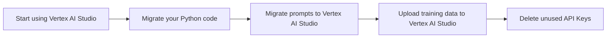

# Migrate from the Gemini Developer API to the Gemini API in Vertex AI

If you are new to Gemini, using the [quickstarts](https://ai.google.dev/gemini-api/docs/quickstart?lang=python) is the fastest way to get started.

However, as your generative AI solutions mature, you might need a platform for building and deploying generative AI applications end-to-end. Google Cloud provides a comprehensive ecosystem of tools to enable developers to harness the power of generative AI, from the initial stages of app development to deployment, hosting, and managing complex data at scale.

Google Cloud's Vertex AI platform offers a suite of MLOps tools that streamline the usage, deployment, and monitoring of AI models for efficiency and reliability. Additionally, integrations with databases, DevOps tools, logging, monitoring, and IAM provide a holistic approach to managing the entire generative AI lifecycle.

**Common use cases for Google Cloud offerings**

Here are some examples of common use cases that are well-suited for Google Cloud offerings:

*   **Productionize your apps and solutions**: Products like [Cloud Functions](https://cloud.google.com/functions/docs/concepts/overview) and [Cloud Run](https://cloud.google.com/run/docs/overview/what-is-cloud-run) let you deploy apps with enterprise-grade scale, security, and privacy. Find more details about security and privacy in the [Security, Privacy, and Cloud Compliance on Google Cloud](https://cloud.google.com/security) guide.
*   **Use Vertex AI for end-to-end MLOps**: Access capabilities from tuning to vector similarity search and ML pipelines.
*   **Trigger your LLM call with an event-driven architecture**: Use [Cloud Functions](https://cloud.google.com/functions/docs/concepts/overview) or [Cloud Run](https://cloud.google.com/run/docs/overview/what-is-cloud-run).
*   **Monitor app usage**: Use [Cloud Logging](https://cloud.google.com/logging/docs) and [BigQuery](https://cloud.google.com/logging/docs/export/bigquery).
*   **Store your data with enterprise-grade security at scale**: Use services like [BigQuery](https://cloud.google.com/bigquery/docs), [Cloud Storage](https://cloud.google.com/storage/docs/introduction), and [Cloud SQL](https://cloud.google.com/sql).
*   **Perform retrieval-augmented generation (RAG)**: Use data in the cloud with [BigQuery](https://cloud.google.com/bigquery/docs) or [Cloud Storage](https://cloud.google.com/storage/docs/introduction).
*   **Create and schedule data pipelines**: You can [schedule jobs](https://cloud.google.com/scheduler/docs/schedule-run-cron-job) using [Cloud Scheduler](https://cloud.google.com/scheduler/docs/overview).
*   **Apply LLMs to your data in the cloud**: If you store data in Cloud Storage or BigQuery, you can prompt LLMs over that data to extract information, summarize, or ask questions about it.
*   **Leverage Google Cloud data governance and residency policies**: Manage your data lifecycle with [data governance/residency](https://cloud.google.com/learn/what-is-data-governance) policies.

## 📚 Differences between the Gemini Developer API and the Gemini API in Vertex AI

The following table summarizes the main differences between the Gemini Developer API and the Vertex AI Gemini API to help you decide which option is right for your use case.

| Features | Gemini Developer API | Vertex AI Gemini API |
| --- | --- | --- |
| **Gemini models** | Gemini 2.0 Flash, Gemini 2.0 Flash-Lite | Gemini 2.0 Flash, Gemini 2.0 Flash-Lite |
| **Sign up** | Google account | Google Cloud account (with terms agreement and billing) |
| **Authentication** | API key | Google Cloud service account |
| **User interface playground** | Google AI Studio | Vertex AI Studio |
| **API & SDK** | Server and mobile/web client SDKs: <ul><li>Server: Python, Node.js, Go, Dart, ABAP</li><li>Mobile/Web client: Android (Kotlin/Java), Swift, Web, Flutter</li></ul> | Server and mobile/web client SDKs: <ul><li>Server: Python, Node.js, Go, Java, ABAP</li><li>Mobile/Web client (via [Vertex AI in Firebase](https://firebase.google.com/docs/vertex-ai)): Android (Kotlin/Java), Swift, Web, Flutter</li></ul> |
| **No-cost usage of API & SDK** | Yes, [where applicable](https://ai.google.dev/gemini-api/docs/billing#is-Gemini-free-in-EEA-UK-CH) | $300 Google Cloud credit for new users |
| **Quota (requests per minute)** | Varies based on model and pricing plan (see [detailed information](https://ai.google.dev/pricing)) | Varies based on model and region (see [detailed information](https://cloud.google.com/vertex-ai/generative-ai/docs/quotas)) |
| **Enterprise support** | No | <ul><li>Customer-managed encryption keys</li><li>Virtual Private Cloud</li><li>Data residency</li><li>Access Transparency</li><li>Scalable infrastructure for application hosting</li><li>Databases and data storage</li></ul> |
| **MLOps** | No | Full MLOps on Vertex AI (examples: model evaluation, Model Monitoring, Model Registry) |

## ⚙️ Migrate to the Gemini API in Vertex AI

This section shows how to migrate from the Gemini Developer API to the Gemini API in Vertex AI.



**Considerations when migrating**

Consider the following when migrating:

*   You can use your existing Google Cloud project (the same one you used to generate your Gemini API key) or you can create a new Google Cloud project.
*   Supported regions might differ between the Gemini Developer API and the Gemini API in Vertex AI. See the list of [supported regions for generative AI on Google Cloud](https://cloud.google.com/vertex-ai/generative-ai/docs/learn/locations).
*   Any models you created in Google AI Studio need to be retrained in Vertex AI.

## ⚙️ Start using Vertex AI Studio
<a name="start-using-vertex-ai-studio"></a>

The process you follow to migrate to the Gemini API in Vertex AI is different depending on whether you already have a Google Cloud account.

> **Note:** Google AI Studio and the Gemini Developer API are available only in [specific regions and languages](https://ai.google.dev/available_regions). If you aren't located in a supported region, you can't start using the Gemini API in Vertex AI.

To learn how to migrate to the Gemini API in Vertex AI, click one of the following tabs, depending on your Google Cloud account status:

=== "Already use Google Cloud"

    1.  Sign in to [Google AI Studio](https://aistudio.google.com/app/waitlist/97445851).
    2.  At the bottom of the left navigation pane, click **Build with Vertex AI on Google Cloud**. The **Try Vertex AI and Google Cloud for free** page opens.
    3.  Click **Agree & Continue**. The **Get Started with Vertex AI studio** dialog appears.
    4.  To enable the APIs required to run Vertex AI, click **Agree & Continue**. The Vertex AI console appears.

=== "New to Google Cloud"

    1.  Sign in to [Google AI Studio](https://aistudio.google.com/app/waitlist/97445851).
    2.  At the bottom of the left navigation pane, click **Build with Vertex AI on Google Cloud**. The **Create an account to get started with Google Cloud** page opens.
    3.  Click **Agree & Continue**. The **Let's confirm your identity** page appears.
    4.  Click **Start Free**. The **Get Started with Vertex AI studio** dialog appears.
    5.  To enable the APIs required to run Vertex AI, click **Agree & Continue**.

## 💻 Python: Migrate to the Gemini API in Vertex AI
<a name="python-migrate-to-the-gemini-api-in-vertex-ai"></a>

The following sections show code snippets to help you migrate your Python code to use the Gemini API in Vertex AI.

**Vertex AI Python SDK Setup**

On Vertex AI, you don't need an API key. Instead, Gemini on Vertex AI is managed using IAM, which controls permissions for a user, a group, or a service account to call the Gemini API through the Vertex AI SDK.

While there are [many ways to authenticate](https://cloud.google.com/docs/authentication#auth-decision-tree), the easiest method for authenticating in a development environment is to [install the Google Cloud CLI](https://cloud.google.com/sdk/docs/install) and then use your user credentials to [sign in to the CLI](https://cloud.google.com/docs/authentication/gcloud#local).

To make inference calls to Vertex AI, you must also make sure that your user or service account has the [Vertex AI User role](https://cloud.google.com/vertex-ai/docs/general/access-control#aiplatform.user).

!!! tip "Troubleshooting"
    If you encounter issues with code snippets or setup, refer to the [Troubleshooting Guide](https://cloud.google.com/vertex-ai/docs/general/troubleshooting?component=any).

### Install the client

=== "Gemini Developer API"

    ```python
    # To install the Python SDK, use this CLI command:
    # pip install google-generativeai
    
    import google.generativeai as genai
    from google.generativeai import GenerativeModel
    
    API_KEY="API_KEY"
    genai.configure(api_key=API_KEY)
    ```

=== "Gemini API in Vertex AI"

    ```python
    # To install the Python SDK, use this CLI command:
    # pip install google-genai
    
    from google import genai
    
    PROJECT_ID = "PROJECT_ID"
    LOCATION = "LOCATION"  # e.g. us-central1
    client = genai.Client(project=PROJECT_ID, location=LOCATION, vertexai=True)
    ```

### Generate text from a text prompt

=== "Gemini Developer API"

    ```python
    model = GenerativeModel("gemini-2.0-flash")
    
    response = model.generate_content("The opposite of hot is")
    print(response.text) #  The opposite of hot is cold.
    ```

=== "Gemini API in Vertex AI"

    ```python
    from google import genai
    from google.genai.types import HttpOptions
    
    client = genai.Client(http_options=HttpOptions(api_version="v1"))
    response = client.models.generate_content(
        model="gemini-2.5-flash-preview-05-20",
        contents="How does AI work?",
    )
    print(response.text)
    # Example response:
    # Okay, let's break down how AI works. It's a broad field, so I'll focus on the ...
    #
    # Here's a simplified overview:
    # ...
    ```

### Generate text from text and an image

=== "Gemini Developer API"

    ```python
    import PIL.Image
    
    multimodal_model = GenerativeModel("gemini-2.0-flash")
    
    image = PIL.Image.open("image.jpg")
    
    response = multimodal_model.generate_content(["What is this picture?", image])
    print(response.text) # A cat is shown in this picture.
    ```

=== "Gemini API in Vertex AI"

    ```python
    from google import genai
    from google.genai.types import HttpOptions, Part
    
    client = genai.Client(http_options=HttpOptions(api_version="v1"))
    response = client.models.generate_content(
        model="gemini-2.5-flash-preview-05-20",
        contents=[
            "What is shown in this image?",
            Part.from_uri(
                file_uri="gs://cloud-samples-data/generative-ai/image/scones.jpg",
                mime_type="image/jpeg",
            ),
        ],
    )
    print(response.text)
    # Example response:
    # The image shows a flat lay of blueberry scones arranged on parchment paper. There are ...
    ```

### Create a multi-turn chat

=== "Gemini Developer API"

    ```python
    model = GenerativeModel("gemini-2.0-flash")
    
    chat = model.start_chat()
    
    print(chat.send_message("How are you?").text)
    print(chat.send_message("What can you do?").text)
    ```

=== "Gemini API in Vertex AI"

    ```python
    from google import genai
    from google.genai.types import HttpOptions, ModelContent, Part, UserContent
    
    client = genai.Client(http_options=HttpOptions(api_version="v1"))
    chat_session = client.chats.create(
        model="gemini-2.5-flash-preview-05-20",
        history=[
            UserContent(parts=[Part(text="Hello")]),
            ModelContent(
                parts=[Part(text="Great to meet you. What would you like to know?")],
            ),
        ],
    )
    response = chat_session.send_message("Tell me a story.")
    print(response.text)
    # Example response:
    # Okay, here's a story for you:
    # ...
    ```

## ⚙️ Migrate prompts to Vertex AI Studio
<a name="migrate-prompts-to-vertex-ai-studio"></a>

Your Google AI Studio prompt data is saved in a Google Drive folder. This section shows how to migrate your prompts to Vertex AI Studio.

???+ "Steps to migrate prompts to Vertex AI Studio"

    1.  Open [Google Drive](https://drive.google.com).
    2.  Navigate to the **AI_Studio** folder where the prompts are stored.
        <figure style="text-align: center;">
          
          <figcaption>Location of prompts in Google Drive.</figcaption>
        </figure>
    3.  Download your prompts from Google Drive to a local directory.
        > **Note:** Prompts downloaded from Google Drive are in the text (`.txt`) format. Before you upload them to Vertex AI Studio, convert them to JSON files by changing the file extension from `.txt` to `.json`.
    4.  Open [Vertex AI Studio](https://console.cloud.google.com/vertex-ai/generative) in the Google Cloud console.
    5.  In the **Vertex AI** menu, click **Prompt management**.
    6.  Click **Import prompt**.
    7.  In the **Prompt file** field, click **Browse** and select a prompt from your local directory. To upload prompts in bulk, you must manually combine your prompts into a single JSON file.
    8.  Click **Upload**. The prompts are uploaded to the **My Prompts** tab.

## ⚙️ Upload training data to Vertex AI Studio
<a name="upload-training-data-to-vertex-ai-studio"></a>

To migrate your training data to Vertex AI, you need to upload your data to a Cloud Storage bucket. For more information, see [Introduction to tuning](https://cloud.google.com/vertex-ai/generative-ai/docs/models/tune-models).

## ⚙️ Delete unused API Keys
<a name="delete-unused-api-keys"></a>

If you no longer need to use your Gemini API key for the Gemini Developer API, follow security best practices and delete it.

???+ "Steps to delete an API key"

    1.  Open the [Google Cloud API Credentials](https://console.cloud.google.com/apis/credentials) page.
    2.  Find the API key that you want to delete and click the **Actions** icon.
    3.  Select **Delete API key**.
    4.  In the **Delete credential** modal, select **Delete**.

    Deleting an API key takes a few minutes to propagate. After propagation completes, any traffic using the deleted API key is rejected.

    !!! warning "Important"
        If you delete a key that's still used in production and need to recover it, see `gcloud beta services api-keys undelete`.

## 🔗 What's next

*   Try a quickstart tutorial using [Vertex AI Studio](../start/quickstarts/quickstart.md) or the [Vertex AI API](../start/quickstarts/quickstart-multimodal.md).