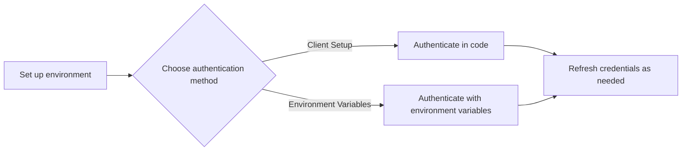

# Authenticate

To use Vertex AI's OpenAI-compatible endpoints, you must first authenticate your client. You can interact with both Google's Gemini models and self-deployed models from Model Garden using the OpenAI Python library.

This guide covers two methods for authenticating your application:
*   **Client Setup**: Programmatically configure authentication within your Python code.
*   **Environment Variables**: Configure authentication by setting variables in your shell environment.

After authenticating, your access token is valid for one hour. This guide also shows you how to create a client that automatically refreshes credentials.

## 📚 Before you begin
<a name="before-you-begin"></a>

???+ "Prerequisites"

    **Install the SDKs**

    Install the Google Cloud and OpenAI Python libraries:
    ```bash
    pip install google-auth requests openai
    ```

    **Set up your local environment**

    To authenticate to Vertex AI, set up Application Default Credentials. For more information, see [Set up authentication for a local development environment](https://cloud.google.com/docs/authentication/provide-credentials-adc#local-dev).

    **Identify your model endpoint**

    Your authentication request must be directed to the correct Vertex AI endpoint.

    *   **Gemini models**: Use the reserved endpoint ID `openapi`.
    *   **Self-deployed models**: Certain models in Model Garden and supported Hugging Face models must be deployed to a Vertex AI endpoint before they can serve requests. When calling these models, you must specify the endpoint ID. To list your existing Vertex AI endpoints, use the `gcloud ai endpoints list` command.

## ⚙️ Authentication workflow

The following diagram shows the workflow for authenticating to Vertex AI with the OpenAI SDK.



## ⚙️ Choose an authentication method
<a name="choose-an-authentication-method"></a>

You can authenticate by either configuring the `OpenAI` client directly in your code or by setting environment variables that the client reads automatically. The following table helps you decide which method is best for your use case.

| Feature | Client Setup | Environment Variables |
| :--- | :--- | :--- |
| **Description** | Programmatically configure the OpenAI client in your application code. | Set environment variables that the OpenAI client reads automatically upon initialization. |
| **Pros** | Explicit and self-contained within the application. Good for applications where you can't easily set environment variables. | Keeps credentials and configuration separate from code, aligning with 12-factor app principles. |
| **Cons** | Credentials and endpoint configuration are mixed with application logic. | Requires shell access to set variables. Might be less portable if the environment isn't controlled. |
| **Use Case** | Interactive environments like Jupyter notebooks, one-off scripts, or applications where dynamic configuration is needed. | Server-side applications, containerized deployments (e.g., Docker, Kubernetes), or CI/CD environments. |

Select a tab for detailed instructions on your chosen method.

=== "Client Setup"

    You can programmatically get Google credentials and configure the OpenAI client in your Python script. This method is useful for notebooks or applications where you prefer to manage configuration explicitly in code.

    The following sample shows how to initialize an `OpenAI` client. It programmatically retrieves an access token from your Application Default Credentials and passes it as the `api_key`.

    By default, access tokens expire after one hour. For long-running applications, see [Refresh your credentials automatically](#refresh-your-credentials-automatically).

    ```python
    import openai
    
    from google.auth import default
    import google.auth.transport.requests
    
    # TODO(developer): Update and un-comment below lines
    # project_id = "PROJECT_ID"
    # location = "us-central1"
    
    # Programmatically get an access token
    credentials, _ = default(scopes=["https://www.googleapis.com/auth/cloud-platform"])
    credentials.refresh(google.auth.transport.requests.Request())
    # Note: the credential lives for 1 hour by default (https://cloud.google.com/docs/authentication/token-types#at-lifetime); after expiration, it must be refreshed.
    
    ##############################
    # Choose one of the following:
    ##############################
    
    # If you are calling a Gemini model, set the ENDPOINT_ID variable to use openapi.
    ENDPOINT_ID = "openapi"
    
    # If you are calling a self-deployed model from Model Garden, set the
    # ENDPOINT_ID variable and set the client's base URL to use your endpoint.
    # ENDPOINT_ID = "YOUR_ENDPOINT_ID"
    
    # OpenAI Client
    client = openai.OpenAI(
        base_url=f"https://{location}-aiplatform.googleapis.com/v1/projects/{project_id}/locations/{location}/endpoints/{ENDPOINT_ID}",
        api_key=credentials.token,
    )
    ```

    !!! tip "Troubleshooting"
        If you encounter issues with code snippets or setup, refer to the [Troubleshooting Guide](https://cloud.google.com/vertex-ai/docs/general/troubleshooting?component=any).

=== "Environment Variables"

    If you have the Google Cloud CLI installed, you can use it to generate an access token and set the `OPENAI_API_KEY` and `OPENAI_BASE_URL` environment variables. The OpenAI library automatically reads these variables to configure the client.

    This method is ideal for server-side applications as it separates configuration from your code.

    1.  **Set environment variables**

        Set your project ID, location, and generate an access token.
        ```bash
        export PROJECT_ID=PROJECT_ID
        export LOCATION=LOCATION
        export OPENAI_API_KEY="$(gcloud auth application-default print-access-token)"
        ```

    2.  **Set the base URL**

        Next, set the `OPENAI_BASE_URL` for your target model.

        *   **To call a Gemini model**, use the `openapi` endpoint:
            ```bash
            export OPENAI_BASE_URL="https://${LOCATION}-aiplatform.googleapis.com/v1beta1/projects/${PROJECT_ID}/locations/${LOCATION}/endpoints/openapi"
            ```

        *   **To call a self-deployed model from Model Garden**, use your specific endpoint ID:
            ```bash
            export ENDPOINT=ENDPOINT_ID
            export OPENAI_BASE_URL="https://${LOCATION}-aiplatform.googleapis.com/v1beta1/projects/${PROJECT_ID}/locations/${LOCATION}/endpoints/${ENDPOINT}"
            ```

    3.  **Initialize the client**

        Now you can initialize the client in your Python code without passing any arguments.
        ```python
        client = openai.OpenAI()
        ```

    By default, access tokens expire after one hour. For long-running applications, you must periodically refresh the `OPENAI_API_KEY` environment variable or use the [client setup method](#client-setup) with an automatic refresher.

    !!! tip "Troubleshooting"
        If you encounter issues with code snippets or setup, refer to the [Troubleshooting Guide](https://cloud.google.com/vertex-ai/docs/general/troubleshooting?component=any).

## 💻 Refresh your credentials automatically
<a name="refresh-credentials"></a>

Access tokens generated from Application Default Credentials expire after one hour. For long-running applications, it's best practice to build a credential refresher that automatically renews the token before it expires.

The following example shows a wrapper class for the `OpenAI` client that checks credential validity before each API call and refreshes the token if necessary.

??? "View an example of a Python credentials refresher class"

    ```python
    from typing import Any
    
    import google.auth
    import google.auth.transport.requests
    import openai
    
    
    class OpenAICredentialsRefresher:
        def __init__(self, **kwargs: Any) -> None:
            # Set a placeholder key here
            self.client = openai.OpenAI(**kwargs, api_key="PLACEHOLDER")
            self.creds, self.project = google.auth.default(
                scopes=["https://www.googleapis.com/auth/cloud-platform"]
            )
    
        def __getattr__(self, name: str) -> Any:
            if not self.creds.valid:
                self.creds.refresh(google.auth.transport.requests.Request())
    
                if not self.creds.valid:
                    raise RuntimeError("Unable to refresh auth")
    
                self.client.api_key = self.creds.token
            return getattr(self.client, name)
    
    
    
    # TODO(developer): Update and un-comment below lines
    # project_id = "PROJECT_ID"
    # location = "us-central1"
    
    client = OpenAICredentialsRefresher(
        base_url=f"https://{location}-aiplatform.googleapis.com/v1/projects/{project_id}/locations/{location}/endpoints/openapi",
    )
    
    response = client.chat.completions.create(
        model="google/gemini-2.0-flash-001",
        messages=[{"role": "user", "content": "Why is the sky blue?"}],
    )
    
    print(response)
    ```

## 🔗 What's next

*   See examples of calling the [Chat Completions API](examples.md) with the OpenAI-compatible syntax.
*   See examples of calling the Inference API with the OpenAI-compatible syntax.
*   See examples of calling the Function Calling API with OpenAI-compatible syntax.
*   Learn more about the Gemini API.
*   Learn more about migrating from Azure OpenAI to the Gemini API.