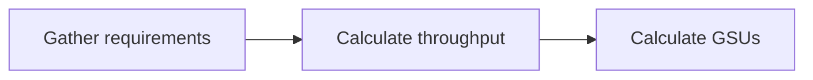

# Calculate Provisioned Throughput requirements

This document explains the concepts of generative AI scale units (GSUs) and burndown rates, which are used to calculate and price Provisioned Throughput.

## 📚 GSU and burndown rate

A **generative AI scale unit (GSU)** is a measure of throughput for your prompts and responses. This amount specifies how much throughput to provision for a model.

A **burndown rate** is a ratio that converts the input and output units (such as tokens, characters, or images) to a standard unit of throughput (e.g., input tokens per second). This ratio represents the processing cost and is used to standardize throughput measurement across different models.

Different models consume different amounts of throughput. For information about the minimum GSU purchase amount and increments for each model, see [Supported models and burndown rates](supported-models.md).

The following equation demonstrates how throughput is calculated:

```
inputs_per_query = inputs_across_modalities_converted_using_burndown_rates
outputs_per_query = outputs_across_modalities_converted_using_burndown_rates

throughput_per_second = (inputs_per_query + outputs_per_query) * queries_per_second
```

The calculated `throughput_per_second` determines the number of GSUs required for your use case.

## 📚 Important Considerations

To help you plan for your Provisioned Throughput needs, review the following important considerations:

*   **Requests are prioritized**: Provisioned Throughput customers are prioritized and serviced first before on-demand requests.

*   **Throughput doesn't accumulate**: Unused throughput doesn't accumulate or carry over to the next month.

*   **Throughput is measured in tokens per second, characters per second, or images per second**: Provisioned Throughput isn't measured solely based on queries per minute (QPM). It's measured based on the query size for your use case, the response size, and the QPM.

*   **Provisioned Throughput is specific to a project, region, model, and version**: Provisioned Throughput is assigned to a specific project-region-model-version combination. The same model called from a different region won't count against your Provisioned Throughput quota and won't be prioritized over on-demand requests.

### Context caching

> **Preview**
>
> This feature is subject to the "Pre-GA Offerings Terms" in the General Service Terms section of the Service Specific Terms. Pre-GA features are available "as is" and might have limited support. For more information, see the launch stage descriptions.

Provisioned Throughput supports default context caching. However, Provisioned Throughput doesn't support caching requests using the Vertex AI API, which include retrieving information about a context cache using the Vertex AI API.

By default, Google automatically caches inputs to reduce cost and latency. For the Gemini 1.5 Flash and Gemini 1.5 Pro models, cached tokens are charged at a 75% discount relative to standard input tokens when a cache hit occurs. For Provisioned Throughput, the discount is applied through a reduced burndown rate.

For example, Gemini 1.5 Pro has the following burndown rates for input text tokens and cached tokens:

*   1 input text token = 1 token
*   1 input cached text token = 0.25 tokens

Sending 1,000 input tokens to this model would result in a burndown of your Provisioned Throughput by 1,000 input tokens per second. However, if you send 1,000 cached tokens to Gemini 1.5 Pro, this results in a burndown of your Provisioned Throughput by 250 tokens per second.

Note that this can lead to higher throughput for similar queries where the tokens aren't cached and the cache discount isn't applied.

To view the burndown rates for models supported in Provisioned Throughput, see [Supported models and burndown rates](supported-models.md).

## ⚙️ Example of estimating your Provisioned Throughput needs

The following workflow outlines the process for estimating the amount of Provisioned Throughput for your model.



!!! tip "Troubleshooting"
    If you encounter issues with the concepts or calculations, refer to the [Troubleshooting Guide](https://cloud.google.com/vertex-ai/docs/general/troubleshooting?component=any).

???+ "Example: Estimating your Provisioned Throughput needs"

    To estimate your Provisioned Throughput needs, you can use the [estimation tool in the Google Cloud console](purchase-provisioned-throughput.md#estimate-provisioned-throughput). The following example illustrates the manual estimation process. The region isn't considered in these calculations.

    This table provides the burndown rates for `gemini-1.0-pro-002` that are used in this example.

    | Model | Throughput per GSU | Units | Minimum GSU purchase increment | Burndown rates |
    |---|---|---|---|---|
    | Gemini 2.0 Flash | 3,360 | Tokens | 1 | 1 input text token = 1 token <br> 1 input image token = 1 token <br> 1 input video token = 1 token <br> 1 input audio token = 7 tokens <br> 1 output text token = 4 tokens |

    **Step 1: Gather your requirements**
    <a name="gather-requirements"></a>

    First, define your workload requirements. In this example, the requirement is to support **10 queries per second (QPS)** for a workload using the `gemini-2.0-flash` model, with the following characteristics per query:
    *   **Input**: 1,000 text tokens and 500 audio tokens
    *   **Output**: 300 text tokens

    To proceed, you will need the [burndown rates](supported-models.md#google-models) for your selected model.

    **Step 2: Calculate your throughput**
    <a name="calculate-throughput"></a>

    Next, calculate the total throughput required per second based on your requirements and the model's burndown rates.

    *   **Calculate total input tokens per query**: Multiply your inputs by their respective burndown rates.
        `1,000 * (1 token per input text token) + 500 * (7 tokens per input audio token) = 4,500 burndown-adjusted input tokens per query.`

    *   **Calculate total output tokens per query**: Multiply your outputs by their burndown rates.
        `300 * (4 tokens per output text token) = 1,200 burndown-adjusted output tokens per query.`

    *   **Calculate total tokens per query**: Add the input and output totals together.
        `4,500 input tokens + 1,200 output tokens = 5,700 total tokens per query.`

    *   **Calculate total throughput per second**: Multiply the total tokens per query by the QPS.
        `5,700 total tokens per query * 10 QPS = 57,000 total tokens per second.`

    **Step 3: Calculate your GSUs**
    <a name="calculate-gsus"></a>

    Finally, convert the required throughput into the number of GSUs you need to purchase.

    *   **Calculate the required GSUs**: Divide the total tokens per second by the per-second throughput per GSU from the burndown table.
        `57,000 total tokens per second ÷ 3,360 per-second throughput per GSU = 16.96 GSUs.`

    *   **Round up to the nearest increment**: The minimum GSU purchase increment for `gemini-2.0-flash` is 1. Therefore, you must round up to the nearest whole number. You will need **17 GSUs** to support your workload.

## 🔗 What's next

*   [Purchase Provisioned Throughput](purchase-provisioned-throughput.md).