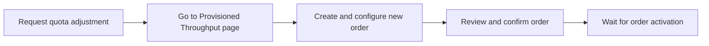

# Purchase Provisioned Throughput

This page provides details to consider before subscribing to Provisioned Throughput, the permissions required to manage orders, and instructions for placing, changing, and viewing your orders.

## 📚 What to consider before purchasing

To help you decide whether to purchase Provisioned Throughput, consider the following:

*   **Commitment term:** Your purchase is a commitment for the selected term. You can't cancel an active order, but you can increase the number of purchased GSUs. If you make a mistake during purchase, [contact your Google Cloud account representative](/contact) for assistance.

*   **Auto-renewal:** You can choose to auto-renew your subscription at the end of its term. You can cancel the auto-renewal up to 30 days before the start of the next term. Monthly subscriptions can be set to renew automatically, but weekly terms do not support this feature.

*   **Order changes:** You can modify your auto-renewal settings, model, or model version for an active order through the Google Cloud console. To change the region, a new order may be required; [contact your Google Cloud account representative](/contact) for assistance. All changes are processed on a best-effort basis, typically within 10 business days.

*   **Model compatibility:** Model changes are limited to the same publisher. For example, you can switch from Google's Gemini 2.0 Pro to Gemini 2.0 Flash, but not from a Google model to an Anthropic model.

*   **Overage billing:** If your throughput exceeds your purchased amount, the overage is billed at the standard pay-as-you-go rate. You can control overages on a per-request basis. For more information, see [Use Provisioned Throughput](use-provisioned-throughput.md).

### Purchase Provisioned Throughput for preview models

> **Preview**
>
> This product or feature is subject to the "Pre-GA Offerings Terms" in the General Service Terms section of the [Service Specific Terms](/terms/service-terms#1). Pre-GA products and features are available "as is" and might have limited support. For more information, see the [launch stage descriptions](/products#product-launch-stages).

You can purchase Provisioned Throughput for Google models in preview, as long as a generally available (GA) version of the model has not been released.

If a GA version is released while you have an active order for a preview model, you can either:
*   Move the order to the GA version of the model. Note that you cannot switch back to the preview model after this change.
*   Continue using the preview version as long as it remains stable. For more information, see [Model versions and lifecycle](../learn/model-versions.md).

## 🔗 Roles and permissions

The `roles/aiplatform.provisionedThroughputAdmin` role grants full access to manage Vertex AI Provisioned Throughput.

This role includes the following permissions:

| Permission                                                 | Description                                  |
| ---------------------------------------------------------- | -------------------------------------------- |
| `aiplatform.googleapis.com/provisionedThroughputs.create`  | Submit a new Provisioned Throughput order.   |
| `aiplatform.googleapis.com/provisionedThroughputs.get`     | View a specific Provisioned Throughput order.|
| `aiplatform.googleapis.com/provisionedThroughputs.list`    | View all Provisioned Throughput orders.      |
| `aiplatform.googleapis.com/provisionedThroughputs.update`  | Modify a Provisioned Throughput order.       |
| `aiplatform.googleapis.com/provisionedThroughputs.cancel`  | Cancel a pending order or pending update.    |

## ⚙️ Place a Provisioned Throughput order

Before placing an order, ensure you have the necessary permissions and quota. Some models, like MedLM-large-1.5, require you to [contact your Google Cloud account representative](/contact) to request access before ordering.

If you expect your queries per minute (QPM) to exceed 30,000, [request a quota adjustment](/docs/quotas/help/request_increase) for `Online prediction requests per minute per region` in the Vertex AI API service.

Orders are processed based on the size of the order and available capacity, which can take from a few minutes to a few weeks.

!!! tip "Troubleshooting"
    If you encounter issues with code snippets or setup, refer to the [Troubleshooting Guide](https://cloud.google.com/vertex-ai/docs/general/troubleshooting?component=any).

???+ "Steps to place a Provisioned Throughput order"

    
    **1. Request quota adjustment (if needed)**

    If your expected QPM exceeds 30,000, request a quota increase for `Online prediction requests per minute per region` for the Vertex AI API service in your target region.

    
    **2. Go to the Provisioned Throughput page**

    In the Google Cloud console, navigate to the Provisioned Throughput page.

    [Go to Provisioned Throughput](https://console.cloud.google.com/vertex-ai/provisioned-throughput){: .md-button}

    
    **3. Create and configure the new order**

    *   Click **New order**.
    *   Enter an **Order name**.
    *   Select the **Model** and **Region**.
    *   Enter the **Number of generative AI scale units (GSUs)** you want to purchase.

    ??? "Optional: Use the GSU estimation tool"

        You can use the estimation tool to help determine the number of GSUs you need.

        1.  Click **Estimation tool**.
        2.  Select your **Model**.
        3.  Based on the model, enter the required details (e.g., queries per second, tokens per query).
        4.  Click **Use calculated** to apply the estimate to your order.

    *   Select your **Term** (1 week, 1 month, 3 months, or 1 year).
    *   Optional: Select a **Start date and time** for your term (Preview). You can schedule a start time up to two weeks in the future. If unspecified, the order starts when capacity is available.
    *   In the **Renewal** list, specify if you want the order to renew automatically at the end of the term (not available for 1-week terms).

    
    **4. Review and confirm the order**

    *   Click **Continue**.
    *   In the **Summary** section, review the price and throughput estimates.
    *   Read the terms and click **Confirm** to finalize your order.

    
    **5. Wait for order activation**

    It can take from a few minutes to a few weeks to process an order. After the order is processed, its status changes to **Active**, and billing begins.

## ⚙️ Change a Provisioned Throughput order

> **Preview**
>
> This feature is subject to the "Pre-GA Offerings Terms" in the General Service Terms section of the [Service Specific Terms](/terms/service-terms#1). Pre-GA features are available "as is" and might have limited support. For more information, see the [launch stage descriptions](/products#product-launch-stages).

You can modify your Provisioned Throughput orders through the Google Cloud console. The table below summarizes the actions you can take based on the order's status. For changes to offline orders, [contact your Google Cloud account representative](/contact).

| Order status       | Permitted Actions                                                              | Conditions                                                                                             |
| ------------------ | ------------------------------------------------------------------------------ | ------------------------------------------------------------------------------------------------------ |
| **Pending review** | Cancel the order.                                                              | If you need other changes, cancel the pending order and place a new one.                               |
| **Approved**       | No modifications allowed.                                                      | The order is awaiting activation and cannot be changed.                                                |
| **Active**         | Increase GSUs, enable/disable auto-renewal, or change the model/model version. | The order must not expire within the next five days unless it is set to auto-renew.                    |

=== "Cancel a pending order"

    To cancel your pending order in the Google Cloud console:

    1.  Go to the [**Provisioned Throughput** page](https://console.cloud.google.com/vertex-ai/provisioned-throughput).
    2.  Select the **Region** where your pending order is located.
    3.  Click the **Order ID** for the order that you want to cancel to go to the **Order details** page.
    4.  Click **Cancel**.
    5.  In the confirmation dialog, click **Cancel Order**.

=== "Edit an active order"

    To change your active order in the Google Cloud console:

    1.  Navigate to the [**Provisioned Throughput** page](https://console.cloud.google.com/vertex-ai/provisioned-throughput).
    2.  Find your active order and do one of the following:
        *   Click the **More actions** (&#8942;) icon in the **Actions** column and select **Edit**.
        *   Click the **Order ID** to open the **Order details** page, then click **Edit**.
    3.  Make your desired changes (e.g., increase GSUs, change model version, update renewal settings).
    4.  Review and confirm the changes.

## 📚 Check order status

After you submit an order, its status will be one of the following:

*   **Pending review**: Your order has been placed and is awaiting review and capacity allocation.
*   **Approved**: Your order has been approved and is awaiting activation. No changes can be made at this stage.
*   **Active**: Your order has been activated, and billing has started.
*   **Expired**: Your order term has ended.

## ⚙️ View Provisioned Throughput orders

???+ "Steps to view your orders"

    1.  In the Google Cloud console, go to the Provisioned Throughput page.

        [Go to Provisioned Throughput](https://console.cloud.google.com/vertex-ai/provisioned-throughput){: .md-button}

    2.  Select the **Region** to see the list of your orders in that region.

## 🔗 What's next

*   [Use Provisioned Throughput](use-provisioned-throughput.md).