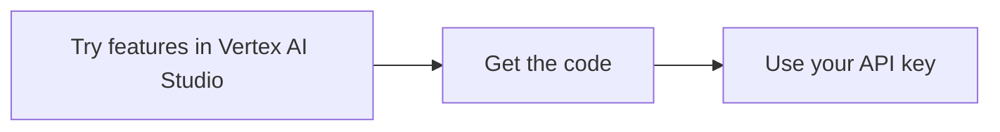

# Vertex AI in express mode overview

> **Preview**
>
> This feature is subject to the "Pre-GA Offerings Terms" in the General Service Terms section of the Service Specific Terms. Pre-GA features are available "as is" and might have limited support. For more information, see the [launch stage descriptions](https://cloud.google.com/products#launch-stages).

Vertex AI in express mode is the fastest way to start building generative AI applications on Google Cloud. Signing up is quick, easy, and doesn't require entering billing information. After you sign up, you can access and use Google Cloud APIs in just a few steps.

To learn more about Vertex AI in express mode, see [Google Cloud express mode FAQs](https://cloud.google.com/vertex-ai/docs/generative-ai/express-mode-faq).

## 📚 Understanding Vertex AI Express Mode Options

Vertex AI in express mode gives you 90 days of free access to core generative AI features with certain quotas. You can enable billing at any time to increase quotas and remove the time limit, or graduate to the full Google Cloud experience to access all services.

The following table compares the different ways to use Vertex AI.

| Item | Vertex AI express mode (no billing) | Vertex AI express mode (with billing) | Full Vertex AI |
| --- | --- | --- | --- |
| **Time limit** | 90 days | Unlimited | Unlimited |
| **Available services** | Basic Generative AI on Vertex AI services. | Expanded Vertex AI services and select Google Cloud services. | All Google Cloud services, including Vertex AI. |
| **Data sources** | Google Drive | Google Drive, web files, YouTube video URLs | All data sources available in Google Cloud. |
| **Quota** | See [Available models and rate limits in express mode](#available-models-and-rate-limits). | See [Rate limits](https://cloud.google.com/vertex-ai/generative-ai/docs/quotas#rate_limits). | See [Rate limits](https://cloud.google.com/vertex-ai/generative-ai/docs/quotas#rate_limits). |
| **Service Level Agreement (SLA)** | None | [Vertex AI SLA](https://cloud.google.com/vertex-ai/sla) | [Vertex AI SLA](https://cloud.google.com/vertex-ai/sla) |
| **API endpoint format** | Uses an API key: <br> `.../models/{model}:streamGenerateContent?key={API_KEY}` | Uses an API key: <br> `.../models/{model}:streamGenerateContent?key={API_KEY}` | Uses a project ID and location: <br> `.../projects/{project}/locations/{location}/...` |

## 📚 Express mode eligibility

Vertex AI in express mode is separate from, and not available through, the [Google Cloud Free Program](https://cloud.google.com/free). If you are in the Google Cloud Free Program, see the other quickstarts in the [Get Started](https://cloud.google.com/vertex-ai/docs/generative-ai/get-started) section to start using Generative AI on Vertex AI.

Vertex AI is available in express mode for developers that click the **[Try Vertex AI Studio free](https://cloud.google.com/generative-ai-studio)** button and sign up using a `@gmail.com` [Google Account](https://accounts.google.com/). Accounts used previously to access Google Cloud are ineligible for express mode and are not shown the **Try Vertex AI Studio free** button. For example, if you used your Google Account to create a Google Cloud free trial account, you are not eligible to sign up in express mode with that same Google Account.

## ⚙️ Get started with express mode

You can start sending requests from your application to Vertex AI APIs in three steps.



???+ "Steps to get started with express mode"

    <a name="step-1-try-features-in-vertex-ai-studio"></a>
    **Step 1: Try features in Vertex AI Studio**

    Use Vertex AI Studio in express mode to quickly try Vertex AI features. For example, in the Google Cloud console in express mode, select **Vertex AI > Freeform** and use the Freeform page to create and optimize multimodal prompts using a variety of Gemini models.

    <a name="step-2-get-the-code"></a>
    **Step 2: Get the code**

    On the Freeform page, click code **Get code**. A panel opens showing code that programmatically sends the same requests that you implemented in the UI. You can get the code for a programming language or as a cURL command. You can use [Google Colab](https://colab.research.google.com/) to try the Python code.

    <a name="step-3-use-your-api-key-to-authenticate"></a>
    **Step 3: Use your API key to authenticate**

    In the Google Cloud console in express mode, click menu **Menu** and select **API Keys**, and then copy your key into your code where it says `"YOUR_API_KEY"`.

## 💻 Code example: Call the Gemini API

The Google Gen AI SDK for Python is available on PyPI and GitHub:

*   [`google-genai` on PyPI](https://pypi.org/project/google-genai/)
*   [`python-genai` on GitHub](https://github.com/googleapis/python-genai)

To learn more, see the [Python SDK reference](https://googleapis.github.io/python-genai/).

```python
from google import genai

# TODO(developer): Update below line
API_KEY = "YOUR_API_KEY"

client = genai.Client(vertexai=True, api_key=API_KEY)

response = client.models.generate_content(
    model="gemini-2.5-flash-preview-05-20",
    contents="Explain bubble sort to me.",
)

print(response.text)
# Example response:
# Bubble Sort is a simple sorting algorithm that repeatedly steps through the list
```

!!! tip "Troubleshooting"
    If you encounter issues with code snippets or setup, refer to the [Troubleshooting Guide](https://cloud.google.com/vertex-ai/docs/general/troubleshooting?component=any).

## ⚙️ Manage your express mode account

Use the following instructions to manage your API keys, quotas, and billing settings.

??? "View and manage API keys"
    <a name="view-and-manage-api-keys"></a>
    To authenticate with Vertex AI API endpoints that support express mode, use the API key that was created for you during sign-up or any key that you've created in express mode.

    To learn more about the best practices for managing API keys, see [Best practices for managing API keys](https://cloud.google.com/docs/authentication/api-keys-best-practices).

    To view and manage your API keys, do the following:

    1.  Go to the Vertex AI Studio Overview page in express mode.

        [Go to Vertex AI Studio](https://console.cloud.google.com/freetrial/?redirectPath=/vertex-ai/studio){: .md-button}

    2.  In the Google Cloud console in express mode, click menu **Menu**.
    3.  Select **API Keys**. The API Keys page opens and you can use it to manage your API keys.

??? "View quotas"
    <a name="view-quotas"></a>
    Your free use of Vertex AI in express mode is restricted by quotas. These quotas restrict the rate at which you can use Vertex AI in express mode at no cost.

    To view your current usage and quotas, do the following:

    1.  Go to the Vertex AI Studio Overview page in express mode.

        [Go to Vertex AI Studio](https://console.cloud.google.com/freetrial/?redirectPath=/vertex-ai/studio){: .md-button}

    2.  In the Google Cloud console in express mode, click menu **Menu**.
    3.  Select **Quotas**.

??? "Enable billing and expand features"
    <a name="enable-billing-and-expand-features"></a>
    You can increase your quotas and remove the 90-day limit by enabling billing. After enabling billing, you pay only for what you use. You can also save your prompts and access additional settings in the console that are grayed out when billing isn't enabled.

    To enable billing, do the following:

    1.  Go to the Vertex AI Studio Overview page in express mode.

        [Go to Vertex AI Studio](https://console.cloud.google.com/freetrial/?redirectPath=/vertex-ai/studio){: .md-button}

    2.  In the Google Cloud console in express mode, click menu **Menu**.
    3.  Select **Billing**.

??? "Graduate to the full Google Cloud experience"
    <a name="graduate-to-the-full-google-cloud-experience"></a>
    You can start using all the capabilities and services available in Google Cloud in your project by graduating from express mode.

    To graduate from express mode, do the following:

    1.  Go to the Vertex AI Studio Overview page in express mode.

        [Go to Vertex AI Studio](https://console.cloud.google.com/freetrial/?redirectPath=/vertex-ai/studio){: .md-button}

    2.  In the Google Cloud console in express mode, click menu **Menu**.
    3.  Select **Billing**.
    4.  In the **Access all Google Cloud** section, click **Learn more and get started**.

    After you graduate from express mode, you must specify your project ID and location instead of your API key when you call REST API endpoints. For example:
    `https://{location}-aiplatform.googleapis.com/v1/projects/{projectid}/locations/{location}/publishers/google/models/{model}:streamGenerateContent`

## 🔗 Reference

### Available models and rate limits
<a name="available-models-and-rate-limits"></a>

You can try out several models in express mode, including the Gemini 2.0 Flash models. The following table lists the models that are available in express mode, along with their rate limits:

| Model category | Available models | Requests per minute |
| --- | --- | --- |
| **Gemini** | `gemini-2.0-flash-001` | 30 |
| | `gemini-2.0-flash-lite-001` | 30 |
| | `gemini-2.5-pro-preview-05-06` | 30 |
| | `gemini-2.5-flash-preview-04-17` | 30 |
| | `gemini-2.5-flash-preview-05-20` | 30 |

For Gemini 2.0 models, the Multimodal Live API isn't available in the Console in express mode. To use the Multimodal Live API in express mode, use the Vertex AI API or the Google Gen AI SDK.

### Key differences in express mode
<a name="key-differences-in-express-mode"></a>

Vertex AI in express mode provides a subset of the features for Generative AI on Vertex AI. For details on the available API endpoints in express mode, see the [Vertex AI in express mode REST API reference](https://cloud.google.com/vertex-ai/docs/generative-ai/reference/express-mode/rest).

In addition, customers in Google Cloud typically use *organizations* and *projects* to work with resources. When using Vertex AI in express mode, you don't need to worry about organizations or projects. You can ignore concepts and instructions that refer to them. The location you selected when signing up is used throughout your experience.

When calling REST API endpoints in express mode, you'll use the endpoint format for express mode and specify your API key.

| | |
| --- | --- |
| **Standard endpoint URL** | `https://{location}-aiplatform.googleapis.com/v1/projects/{project}/locations/{location}/publishers/google/models/{model}:streamGenerateContent` |
| **Endpoint URL in express mode** | `https://aiplatform.googleapis.com/v1/publishers/google/models/{model}:streamGenerateContent?key={API_KEY}` |

## 🔗 What's next

*   Try the [Vertex AI Studio tutorial](vertex-ai-studio-express-mode-quickstart.md) for Vertex AI in express mode.
*   Try the [API tutorial](vertex-ai-express-mode-api-quickstart.md) for Vertex AI in express mode.
*   See the complete [API reference for Vertex AI in express mode](https://cloud.google.com/vertex-ai/docs/generative-ai/reference/express-mode/rest).