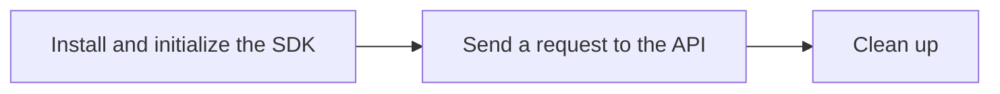

# Tutorial: Vertex AI API in express mode

> **Preview**
>
> This feature is subject to the "Pre-GA Offerings Terms" in the General Service Terms section of the Service Specific Terms. Pre-GA features are available "as is" and might have limited support. For more information, see the launch stage descriptions.

Vertex AI in [express mode](overview.md) lets you quickly try out core generative AI features that are available on Vertex AI. This tutorial shows you how to perform the following tasks by using the Vertex AI API in express mode:

*   Install and initialize the Google Gen AI SDK for express mode.
*   Send a request to the Gemini for Google Cloud API, including streaming, non-streaming, and function calling requests.

To see these steps in action, you can run the "Getting started with Gemini using Vertex AI in Express Mode" Jupyter notebook in one of the following environments:

[Open in Colab](https://colab.research.google.com/github/GoogleCloudPlatform/generative-ai/blob/main/gemini/getting-started/intro_gemini_express.ipynb){: .md-button}
[Open in Colab Enterprise](https://console.cloud.google.com/vertex-ai/colab/import/https%3A%2F%2Fraw.githubusercontent.com%2FGoogleCloudPlatform%2Fgenerative-ai%2Fmain%2Fgemini%2Fgetting-started%2Fintro_gemini_express.ipynb){: .md-button}
[Open in Vertex AI Workbench](https://console.cloud.google.com/vertex-ai/workbench/deploy-notebook?download_url=https%3A%2F%2Fraw.githubusercontent.com%2FGoogleCloudPlatform%2Fgenerative-ai%2Fmain%2Fgemini%2Fgetting-started%2Fintro_gemini_express.ipynb){: .md-button}
[View on GitHub](https://github.com/GoogleCloudPlatform/generative-ai/blob/main/gemini/getting-started/intro_gemini_express.ipynb){: .md-button}



## ⚙️ Tutorial

???+ "Use the Vertex AI API in express mode"

    <a name="install-and-initialize-the-sdk"></a>
    **Step 1: Install and initialize the Google Gen AI SDK**

    The Google Gen AI SDK lets you use Google generative AI models and features to build AI-powered applications. When using Vertex AI in express mode, install and initialize the `google-genai` package to authenticate using your generated API key.

    **Install the SDK**

    To install the Google Gen AI SDK for express mode, run the following commands. If you're using Colab, ignore any dependency conflicts and restart the runtime after installation.

    ```python
    # Developer TODO: If you're using Colab, uncomment the following lines:
    # from google.colab import auth
    # auth.authenticate_user()

    !pip install google-genai

    !pip install --force-reinstall -qq "numpy<2.0"
    ```

    **Initialize the client**

    Configure the API key for express mode and environment variables. For details on getting an API key, see [Vertex AI in express mode overview](overview.md).

    ```python
    from google import genai
    from google.genai import types

    # Developer TODO: Replace YOUR_API_KEY with your API key.
    API_KEY = "YOUR_API_KEY"

    client = genai.Client(
        vertexai=True, api_key=API_KEY
    )
    ```

    !!! tip "Troubleshooting"
        If you encounter issues with code snippets or setup, refer to the [Troubleshooting Guide](https://cloud.google.com/vertex-ai/docs/general/troubleshooting?component=any).

    <a name="send-a-request-to-the-api"></a>
    **Step 2: Send a request to the Gemini API**

    You can send requests to the Gemini API in two primary ways: streaming or non-streaming. Streaming requests return response chunks as they are generated, reducing perceived latency for users. Non-streaming requests return the entire response at once.

    The following table compares these two methods.

    | Feature | Streaming Request | Non-Streaming Request |
    | :--- | :--- | :--- |
    | **Response Delivery** | Returns the response in chunks as it's generated. | Returns the complete response in a single chunk after processing. |
    | **Perceived Latency** | Lower. Users see output immediately, which is ideal for interactive applications. | Higher. Users must wait for the entire response to be generated before seeing any output. |
    | **Use Case** | Chatbots, live content generation, applications where immediate feedback is crucial. | Batch processing, text summarization, tasks where the full context is needed at once. |
    | **Implementation** | Set `stream=True` and iterate through the response chunks. | Call the `generate_content` method and process the single response object. |

    You can also make function calling requests to connect the model to external tools and APIs. Select a tab to view the code for each request type.

    === "Streaming request"

        To send a streaming request, set `stream=True` and print the response in chunks.

        ```python
        from google import genai
        from google.genai import types

        def generate():
          client = genai.Client(vertexai=True, api_key=YOUR_API_KEY)
          
          config=types.GenerateContentConfig(
              temperature=0,
              top_p=0.95,
              top_k=20,
              candidate_count=1,
              seed=5,
              max_output_tokens=100,
              stop_sequences=["STOP!"],
              presence_penalty=0.0,
              frequency_penalty=0.0,
              safety_settings=[
                  types.SafetySetting(
                      category="HARM_CATEGORY_HATE_SPEECH",
                      threshold="BLOCK_ONLY_HIGH",
                  )
              ],
          )
          for chunk in client.models.generate_content_stream(
            model="gemini-2.0-flash-001",
            contents="Explain bubble sort to me",
            config=config,
          ):
            print(chunk.text)

        generate()
        ```

    === "Non-streaming request"

        The following code sample defines a function that sends a non-streaming request to `gemini-2.0-flash-001`. It shows you how to configure basic request parameters and safety settings.

        ```python
        from google import genai
        from google.genai import types

        def generate():
          client = genai.Client(vertexai=True, api_key=YOUR_API_KEY)
          
          config=types.GenerateContentConfig(
              temperature=0,
              top_p=0.95,
              top_k=20,
              candidate_count=1,
              seed=5,
              max_output_tokens=100,
              stop_sequences=["STOP!"],
              presence_penalty=0.0,
              frequency_penalty=0.0,
              safety_settings=[
                  types.SafetySetting(
                      category="HARM_CATEGORY_HATE_SPEECH",
                      threshold="BLOCK_ONLY_HIGH",
                  )
              ],
          )
          response = client.models.generate_content(
            model="gemini-2.0-flash-001",
            contents="Explain bubble sort to me",
            config=config,
          )
          print(response.text)

        generate()
        ```

    === "Function calling request"

        The following code sample declares a function and passes it as a tool, and then receives a function call part in the response. After you receive the function call part from the model, you can invoke the function, get the response, and then pass the response back to the model.

        ```python
        function_response_parts = [
            {
                'function_response': {
                    'name': 'get_current_weather',
                    'response': {
                        'name': 'get_current_weather',
                        'content': {'weather': 'super nice'},
                    },
                },
            },
        ]
        manual_function_calling_contents = [
            {'role': 'user', 'parts': [{'text': 'What is the weather in Boston?'}]},
            {
                'role': 'model',
                'parts': [{
                    'function_call': {
                        'name': 'get_current_weather',
                        'args': {'location': 'Boston'},
                    }
                }],
            },
            {'role': 'user', 'parts': function_response_parts},
        ]
        function_declarations = [{
            'name': 'get_current_weather',
            'description': 'Get the current weather in a city',
            'parameters': {
                'type': 'OBJECT',
                'properties': {
                    'location': {
                        'type': 'STRING',
                        'description': 'The location to get the weather for',
                    },
                    'unit': {
                        'type': 'STRING',
                        'enum': ['C', 'F'],
                    },
                },
            },
        }]

        response = client.models.generate_content(
            model="gemini-2.0-flash-001",
            contents=manual_function_calling_contents,
            config=dict(tools=[{'function_declarations': function_declarations}]),
        )
        print(response.text)
        ```

    <a name="clean-up"></a>
    **Step 3: Clean up**

    This tutorial does not create any Google Cloud resources, so no cleanup is needed to avoid charges.

## 🔗 What's next

*   Try the [Vertex AI Studio tutorial](vertex-ai-studio-express-mode-quickstart.md) for Vertex AI in express mode.
*   See the complete API reference for Vertex AI in express mode.