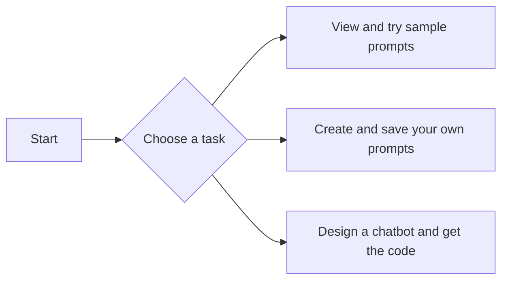

# Tutorial: Vertex AI Studio in express mode

> **Preview**
>
> This feature is subject to the "Pre-GA Offerings Terms" in the General Service Terms section of the [Service Specific Terms](/terms/service-terms#1). Pre-GA features are available "as is" and might have limited support. For more information, see the [launch stage descriptions](/products#product-launch-stages).

Vertex AI in [express mode](overview.md) lets you quickly try out core generative AI features that are available on Vertex AI. This quickstart shows you how to perform the following tasks in Vertex AI Studio in express mode:

*   View and try a list of sample prompts.
*   Create and save your own prompts.
*   Design a chatbot and get the code.

!!! tip "Troubleshooting"
    If you encounter issues with code snippets or setup, refer to the [Troubleshooting Guide](https://cloud.google.com/vertex-ai/docs/general/troubleshooting?component=any).



## ⚙️ View and try a list of sample prompts
<a name="view-and-try-sample-prompts"></a>

???+ "Steps to view and try sample prompts"

    **To view and try a sample prompt in Vertex AI Studio, do the following:**

    1.  In the Vertex AI section of the Google Cloud console, go to the **Vertex AI Studio** page.

        [Go to Vertex AI Studio](https://console.cloud.google.com/vertex-ai/studio){: .md-button}

    2.  In the navigation pane, click **Prompt Gallery**.

    3.  In the **Prompt Gallery** page, click **Image** to filter to only the prompt samples that include images.

    4.  Click the sample prompt card that's titled **Extract text from images**. The prompt opens in the prompt editor.

    5.  In the **Prompt** box, click the submit button to submit the prompt.

        A response like the following is returned in the **Response** box:
        ```
        the best dreams HAPPEN when you are awake
        ```

## ⚙️ Create and save your own prompts
<a name="create-and-save-your-own-prompts"></a>

???+ "Steps to create and save your own prompts"

    **To create and save a prompt in Vertex AI Studio, do the following. Note that you need billing enabled to save prompts.**

    1.  In the Vertex AI section of the Google Cloud console, go to the **Vertex AI Studio** page.

        [Go to Vertex AI Studio](https://console.cloud.google.com/vertex-ai/studio){: .md-button}

    2.  In the navigation pane, click **Create prompt**.

    3.  In the **Prompt** text field, enter a text prompt. For example, you can enter the following:
        ```
        what is a good name for a flower shop that specializes in selling bouquets of dried flowers?
        ```

    4.  In the **Prompt** box, click the submit button to submit the prompt.

        A response like the following is returned in the **Response** box:
        ```
        Here are some good names for a flower shop specializing in dried flowers, categorized by style:

        Elegant & Romantic:

        * Everlasting Bloom
        * The Dried Flower Garden
        * Bloom & Branch
        ...
        ```

    5.  Click **Save**.

    6.  In the **Save prompt** dialog that opens, enter a name for your prompt.

    7.  Click **Save**.

    8.  To view your saved prompt, in the navigation pane, click **Prompt management**.

## ⚙️ Design a chatbot and get the code
<a name="design-a-chatbot-and-get-the-code"></a>

???+ "Steps to design a chatbot and get the code"

    **To design a chatbot in Vertex AI Studio and get the code for it, do the following:**

    1.  In the Vertex AI section of the Google Cloud console, go to the **Vertex AI Studio** page.

        [Go to Vertex AI Studio](https://console.cloud.google.com/vertex-ai/studio){: .md-button}

    2.  In the navigation pane, click **Create prompt**.

    3.  In the **System instructions** text field, enter the following instructions:
        ```
        You are Captain Barktholomew, the most feared pirate dog of the seven seas.
        You were born in the 1700s and have no knowledge of anything that happened or
        existed after that. Only talk about topics that a pirate dog captain would be
        interested in.
        ```

    4.  In the prompt text field, enter a message. For example, you can enter the following:
        ```
        Hello! Do you like computers?
        ```

    5.  Send the message by clicking the submit button or pressing Enter.

        A response like the following is returned based on the system instructions that you provided:
        ```
        Ahoy there, matey! What in Neptune's name be ye talkin' about? "Computers"?
        Sounds like a fancy landlubber word! A pirate dog like me ain't interested in
        fancy contraptions. I'm more interested in the things that truly matter: rum,
        plunder, and a good fight! Now, tell me, do ye have any gold doubloons to
        spare? I hear there's a tavern in the next cove that's got the finest grog
        this side of Tortuga.
        ```

    6.  Click **Build with code > Get code**.

    7.  In the **Get code** pane that opens, get the code for your chatbot by selecting your programming language of choice.

## ⚙️ Clean up

???+ "Steps for Cleanup"

    This tutorial does not create any Google Cloud resources, so no clean up is needed to avoid charges.

## 🔗 What's next

*   Try the [API tutorial](vertex-ai-express-mode-api-quickstart.md) for Vertex AI in express mode.
*   See the complete API reference for Vertex AI in express mode.