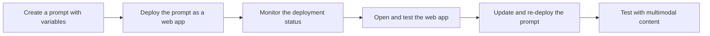

# Quickstart: Deploy your Vertex AI Studio prompt as a web application

> **Preview**
>
> This feature is subject to the "Pre-GA Offerings Terms" in the General Service Terms section of the [Service Specific Terms](/terms/service-terms#1). Pre-GA features are available "as is" and might have limited support. For more information, see the [launch stage descriptions](/products#product-launch-stages).

In Vertex AI Studio, you can design and iterate your prompts and compare results from different configurations and models. Once you finish engineering your prompt, you can deploy it as a web application to share with your collaborators or target users. The web application is hosted on Cloud Run and is available outside the Google Cloud console.

In this quickstart, you will:

*   Create a prompt with prompt variables.
*   Deploy your prompt as a web application.
*   Monitor deployment progress and test the deployed application.
*   Update and re-deploy your prompt.
*   Test prompt submission with multimodal support.

## ⚙️ Before you begin

???+ "Prerequisites"

    If you have never used Vertex AI Studio before, you can follow [another quickstart guide](quickstart.md) or take the [Google Cloud Skills Boost course](https://www.cloudskillsboost.google/course_templates/552) to learn the basics. For this guide, you should have the following:

    1.  A Google Cloud project with billing enabled.
    2.  The Vertex AI API enabled.

## 📚 Additional permissions required

In addition to existing permissions for using Vertex AI Studio, you need the following permissions to deploy your prompt:

| Action | Required permissions | Purpose |
|---|---|---|
| Enable additional APIs | `serviceusage.services.enable` | Enable the following APIs: <ul><li>Cloud Run Admin API (`run.googleapis.com`)</li><li>Artifact Registry API (`artifactregistry.googleapis.com`)</li><li>Cloud Build API (`cloudbuild.googleapis.com`)</li><li>Cloud Logging API (`logging.googleapis.com`)</li></ul> |
| Grant permissions to service accounts | `resourcemanager.projects.setIamPolicy` | Grant the [Compute Engine default service account](/compute/docs/access/service-accounts#default_service_account) the following roles: <ul><li>[Vertex AI Service Agent](/vertex-ai/docs/general/access-control#aiplatform.serviceAgent) (`roles/aiplatform.serviceAgent`)</li><li>[Cloud Build Service Account](/iam/docs/understanding-roles#cloudbuild.builds.builder) (`roles/cloudbuild.builds.builder`)</li></ul> |
| Deploy specific permissions | <ul><li>`storage.buckets.create`</li><li>`run.services.create`</li><li>`artifactregistry.repositories.create`</li><li>`run.services.setIamPolicy`</li></ul> | During deployment, source code is uploaded to Cloud Storage and then deployed to a new Cloud Run service. The `artifactregistry.repositories.create` permission is required to create a repository for the container image. The `run.services.setIamPolicy` permission is required to make the service publicly accessible. |

If you are the owner of your project, you don't need to take additional actions beyond following the guide in Vertex AI Studio. If you are not the project owner, ask your administrator to perform the first two actions and then grant you the **Editor** (`roles/editor`) and **Cloud Run Admin** (`roles/run.admin`) roles.

## ⚙️ Deploy and test your prompt

???+ "Steps to deploy and test your prompt"

    **Create a prompt with prompt variables**
    

    1. Navigate to the [create prompt page](https://console.cloud.google.com/vertex-ai/studio/multimodal) of Vertex AI Studio.
    2. Click **Add variable** in the prompt input box.
    3. In the **Manage prompt variables** dialog, enter a variable name, give it a value, and click **Apply**.

    <figure style="text-align: center;">
      
      <figcaption>Manage prompt variables dialog.</figcaption>
    </figure>

    4. In the prompt input box, compose the prompt using the variable and adjust other parameters. For example, you can enable **Grounding with Google Search** and add "Always get current weather from the web" as system instructions.

    **Deploy your prompt as a web application**
    

    1. To deploy your prompt, click the **Build with code** button in the top right corner, then click **Deploy as app**.

    <figure style="text-align: center;">
      
      <figcaption>Click "Build with code" and then "Deploy as app".</figcaption>
    </figure>

    **Save the prompt**

    A dialog will pop up to save the prompt, which is required before deployment. The deploy dialog opens automatically after the prompt is saved.

    <figure style="text-align: center;">
      
      <figcaption>Save the prompt before deployment.</figcaption>
    </figure>

    > **Note:** Saving your prompt in a region for the first time can take 2-3 minutes. A warning box will appear after 1 minute. This is an expected one-time operation. Subsequent saves in the same project and region will take only a few seconds.

    **Enable APIs and grant permissions for the first deployment**

    If this is your first deployment, you will see a dialog for enabling required APIs. Click **Enable required APIs.**

    After the APIs are enabled, the **Create a web app** dialog appears. Since access control is not supported in Public Preview, all deployed applications will have public access. **Don't include sensitive or personally identifiable information (PII) in your prompt.**

    Check the **I understand this app will be deployed publicly** checkbox, and then click **Create app**.

    If this is your first deployment, another dialog will pop up asking you to grant the required roles to the service account. Click **Grant all** to proceed.

    > **Note:** If you don't have permissions to enable APIs or grant access, ask your project administrator to grant them for you. See [Additional permissions required](#additional-permissions) for more details.

    **Deployment starts**

    Vertex AI Studio creates a zip file with the web application's source code and uploads it to a Cloud Storage bucket. After deployment starts, the **Manage web app** dialog appears with deployment information.

    <figure style="text-align: center;">
      
      <figcaption>The Manage web app dialog shows deployment details.</figcaption>
    </figure>

    !!! tip "Troubleshooting"
        If you encounter issues with code snippets or setup, refer to the [Troubleshooting Guide](https://cloud.google.com/vertex-ai/docs/general/troubleshooting?component=any).

    **Monitor the deployment status**
    

    Deployment takes 2-3 minutes. The status is shown in the **Manage web app** dialog. If you close the dialog, you can reopen it from the menu under the **Build with code** button.

    Once deployment is complete, the status changes to **Ready**, and an **Open** button appears.

    <figure style="text-align: center;">
      
      <figcaption>The "Open" button appears when the app is ready.</figcaption>
    </figure>

    You can also monitor the status from the **Notifications** menu (bell icon). A green circle on the bell icon indicates a successful deployment.

    <figure style="text-align: center;">
      
      <figcaption>Monitor deployment status from the notification bell.</figcaption>
    </figure>

    **Access control and secret key**

    Your web application is deployed with **Allow unauthenticated** access enabled by default. To provide basic protection, the web application requires a secret key in the URL. You can find this key in the **Secret Key** column of the **Manage web app** dialog. When you open the app from Vertex AI Studio, the key is appended automatically.

    **Open and test the web application**
    

    1. Click **Open** in the **Manage web app** dialog. The application URL will include the secret key (`?key=SECRET_KEY`).
    2. Enter a value for the variable and click **Submit**. The results will appear on the right.

    <figure style="text-align: center;">
      
      <figcaption>Submit the prompt and view results in the web app.</figcaption>
    </figure>

    > **Note:** Cloud Run is serverless, so the application container may shut down if idle. If the app is slow to load or a submission fails, refreshing the page usually solves the issue.

    **Update and re-deploy your prompt**
    

    1. Edit your prompt in Vertex AI Studio (e.g., turn it into a conversation).
    2. Click the **Build with code** button and select **Manage app**.
    3. In the **Manage web app** dialog, click **Update app**.
    4. A confirmation dialog will appear, warning that changes made outside Vertex AI Studio (e.g., in the Cloud Run source editor) will be overwritten. Click **Confirm**.
    5. After the update is complete, open the web application again. You will see the updated UI.

    <figure style="text-align: center;">
      
      <figcaption>The updated app with a conversation UI.</figcaption>
    </figure>

    **Insert multimodal content**
    

    You can add inputs like images, videos, audio, and documents to the conversation. Supported input types depend on the selected model. See the [documentation for multimodal support for each model](https://ai.google.dev/gemini-api/docs/models#model-variations).

    1. To insert a file, click the **clip** icon in the conversation input box.
    2. You can then interact with the model using the provided input.

    <figure style="text-align: center;">
      
      <figcaption>Interact with the model using multimodal inputs.</figcaption>
    </figure>

## 📚 Advanced Topics

Once you are familiar with the deployment process, you can explore the following actions.

??? "Edit source code in Cloud Run"

    If you want to customize the web application, you can edit its source code in Cloud Run.

    1.  Open the **Manage web app** dialog and click the **more_vert** icon at the end of the row to find the link to the source code editor.
    2.  Alternatively, click the **source code editor** link from the deployed web application.
    3.  In the Cloud Run source code page, click **Edit source**.
    4.  When you are done, click **Save and redeploy**.

    > **Note:** Cloud Run doesn't support version control directly. If you re-deploy from Vertex AI Studio, your changes will be overwritten. To save a version, click **Download ZIP** before re-deploying.

??? "Turn off public access"

    When you no longer need the web application to be publicly accessible, you can disable public access in Cloud Run.

    1.  Open the **Manage Web App** dialog and click the **edit** pencil icon in the **Access Control** column. The Cloud Run security page will open.
    2.  Alternatively, navigate to the security page from the web application by clicking the **Security settings** link.
    3.  On the Security page, check **Use Cloud IAM to authenticate incoming requests** and choose **Require authentication**.
    4.  Click **Save**. Your web application will no longer be accessible via its public URL.

??? "Turn on public access again"

    To restore public access, clear the **Use Cloud IAM to authenticate incoming requests** checkbox on the Cloud Run security page and save. Choosing **Allow unauthenticated invocations** may not work if your project is in an organization. See [Authentication in Cloud Run](/run/docs/authenticating/overview) for more details.

??? "Set up local access for development"

    If you have turned off public access, you can access the web application by setting up a local proxy using `gcloud` commands.

    1.  Open Cloud Shell by clicking the **terminal** icon in the top right corner of the Google Cloud console and authorize it.
    2.  Open the **Manage web app** dialog, click the **more_vert** icon, and select **Set up local access via Cloud Shell**.
    3.  A command will be added to your Cloud Shell. Press **Enter** to run it.
    4.  Click the link provided in the Cloud Shell output to preview your application locally. This link only works while the `gcloud` command is running.

    !!! tip "Troubleshooting"
        If you encounter issues with code snippets or setup, refer to the [Troubleshooting Guide](https://cloud.google.com/vertex-ai/docs/general/troubleshooting?component=any).

## 🔗 Common issues

??? "Authentication error: No secret key"

    If you see an error indicating a missing secret key, it means the key was not appended to the URL. Open the web application from Vertex AI Studio, or copy the secret key from the **Manage app** dialog and append it to the URL in the format `?key=SECRET_KEY`.

    <figure style="text-align: center;">
      
      <figcaption>Error message for a missing secret key.</figcaption>
    </figure>

??? "Authentication error: Invalid secret key"

    This error means the key in the URL is invalid. The secret key is unique to each prompt. Ensure you are using the correct key for the specific prompt.

    <figure style="text-align: center;">
      
      <figcaption>Error message for an invalid secret key.</figcaption>
    </figure>

??? "400 Invalid argument: empty input"

    This error occurs if your prompt has input variables but the chat input is empty. To fix this, type any non-empty content into the chat box and resubmit.

    <figure style="text-align: center;">
      
      <figcaption>Error message for empty chat input.</figcaption>
    </figure>

??? "400 Invalid argument: mimeType is not supported"

    This error occurs if you upload a file type that the model does not support. You must use a file type that is supported by the selected model. See the [documentation for multimodal support for each model](https://ai.google.dev/gemini-api/docs/models#model-variations).

    <figure style="text-align: center;">
      
      <figcaption>Error message for an unsupported file type.</figcaption>
    </figure>

## 🔗 Next steps

*   Explore more features in the [Vertex AI Studio documentation](/vertex-ai/docs/studio/introduction) or the [Introduction to Vertex AI Studio Google Cloud Skills Boost](https://www.cloudskillsboost.google/course_templates/552) course.
*   Learn about [pricing for Cloud Run](/run/pricing).
*   Learn about [authentication in Cloud Run](/run/docs/authenticating/overview).