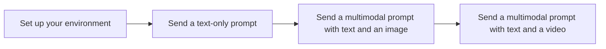

# Quickstart: Generate content using the Vertex AI Gemini API

To see an example of getting started with Gemini, run the "Intro to Gemini 2.0 Flash" Jupyter notebook in one of the following environments:

[Open in Colab](https://colab.research.google.com/github/GoogleCloudPlatform/generative-ai/blob/main/gemini/getting-started/intro_gemini_2_0_flash.ipynb){: .md-button} [Open in Colab Enterprise](https://console.cloud.google.com/vertex-ai/colab/import/https%3A%2F%2Fraw.githubusercontent.com%2FGoogleCloudPlatform%2Fgenerative-ai%2Fmain%2Fgemini%2Fgetting-started%2Fintro_gemini_2_0_flash.ipynb){: .md-button} [Open in Vertex AI Workbench](https://console.cloud.google.com/vertex-ai/workbench/deploy-notebook?download_url=https%3A%2F%2Fraw.githubusercontent.com%2FGoogleCloudPlatform%2Fgenerative-ai%2Fmain%2Fgemini%2Fgetting-started%2Fintro_gemini_2_0_flash.ipynb){: .md-button} [View on GitHub](https://github.com/GoogleCloudPlatform/generative-ai/blob/main/gemini/getting-started/intro_gemini_2_0_flash.ipynb){: .md-button}

In this quickstart, you send the following multimodal requests to the Vertex AI Gemini API and view the responses:

*   A text-only prompt
*   A multimodal prompt with text and an image
*   A multimodal prompt with text and a video file



## ⚙️ Before you begin
<a name="set-up-your-environment"></a>

???+ "Expand to see all setup instructions"

    **Set up your Google Cloud project**

    1.  Sign in to your Google Cloud account. If you're new to Google Cloud, [create an account](https://console.cloud.google.com/freetrial) to evaluate how our products perform in real-world scenarios. New customers also get $300 in free credits to run, test, and deploy workloads.
    2.  In the Google Cloud console, on the project selector page, select or create a Google Cloud project.

        **Note**: If you don't plan to keep the resources that you create in this procedure, create a project instead of selecting an existing project. After you finish these steps, you can delete the project, removing all resources associated with the project.

        [Go to project selector](https://console.cloud.google.com/projectselector2/home/dashboard){: .md-button}

    3.  Make sure that billing is enabled for your Google Cloud project.
    4.  Enable the Vertex AI API.

        [Enable the API](https://console.cloud.google.com/flows/enableapi?apiid=aiplatform.googleapis.com){: .md-button}

    **Set up the Google Cloud CLI**

    On your local machine, set up and authenticate with the Google Cloud CLI. The Vertex AI Gemini API uses Identity and Access Management (IAM) for access control, unlike the API keys used in Google AI Studio.

    1.  [Install and initialize the Google Cloud CLI](https://cloud.google.com/sdk/docs/install).
    2.  If you previously installed the gcloud CLI, update your components:
        ```bash
        gcloud components update
        ```
    3.  Authenticate with the gcloud CLI to generate local Application Default Credentials (ADC):
        ```bash
        gcloud auth application-default login
        ```
    For more information, see [Set up Application Default Credentials](https://cloud.google.com/docs/authentication/provide-credentials-adc#local-dev).

    **Note:** To avoid providing your project ID and region with every command, you can set default values:
    ```bash
    gcloud config set project YOUR_PROJECT_ID
    gcloud config set location YOUR_REGION
    ```

    **Choose and set up an SDK or the REST API**

    For Node.js and Java, you can use either the Google AI Gemini SDKs, which offer a streamlined experience for developers familiar with the Google AI ecosystem, or the Vertex AI SDKs, which are tightly integrated with all Vertex AI services. For other languages, one primary SDK is recommended.

    | Feature                | Google AI Gemini SDKs                                                                          | Vertex AI SDKs                                                                                             |
    | ---------------------- | ---------------------------------------------------------------------------------------------- | ---------------------------------------------------------------------------------------------------------- |
    | **Primary Use Case**   | Quickly prototype with Gemini models. Offers a simpler, more direct API surface.               | Production-ready, enterprise-grade applications on Google Cloud.                                           |
    | **Authentication**     | API Keys (for Google AI Studio) or `gcloud` user credentials (for Vertex AI).                  | Service Accounts or `gcloud` user credentials (IAM).                                                       |
    | **Integration**        | Can be configured to call Vertex AI endpoints.                                                 | Tightly integrated with the entire Vertex AI ecosystem (e.g., Model Garden, Pipelines, Vector Search).     |
    | **Supported Languages**| Python, Go, Node.js, Java                                                                      | Python, Go, Node.js, Java, C#                                                                              |
    | **Choose this if...**  | You are familiar with the Google AI SDKs from Google AI Studio and want to migrate to Vertex AI. | You are building a new application on Vertex AI or need to integrate with other Vertex AI services.        |

    Select a tab to view the installation instructions for your chosen language or tool.

    === "Python (Gen AI SDK)"

        Install or update the SDK for Python. To learn more, see the [SDK reference documentation](https://googleapis.github.io/python-genai/).
        ```bash
        pip install --upgrade google-cloud-aiplatform
        ```

    === "Go (Gen AI SDK)"

        Install or update the SDK for Go. To learn more, see the [SDK reference documentation](https://pkg.go.dev/google.golang.org/genai).
        ```bash
        go get google.golang.org/genai
        ```

    === "Node.js (Gen AI SDK)"

        Install or update the SDK for Node.js. To learn more, see the [SDK reference documentation](https://googleapis.github.io/js-genai/).
        ```bash
        npm install @google/genai
        ```

    === "Java (Gen AI SDK)"

        Add the following Maven dependency to your `pom.xml`. To learn more, see the [SDK reference documentation](https://central.sonatype.com/artifact/com.google.genai/google-genai).
        ```xml
        <dependencies>
          <dependency>
            <groupId>com.google.genai</groupId>
            <artifactId>google-genai</artifactId>
            <version>0.7.0</version>
          </dependency>
        </dependencies>
        ```

    === "Node.js (Vertex AI SDK)"

        Before trying the samples, follow the setup instructions in the [Vertex AI quickstart using client libraries](https://cloud.google.com/vertex-ai/docs/start/client-libraries#node.js). For more information, see the [Vertex AI Node.js API reference documentation](https://cloud.google.com/nodejs/docs/reference/vertexai/latest).
        ```bash
        npm install @google-cloud/vertexai
        ```

    === "Java (Vertex AI SDK)"

        Before trying the samples, follow the setup instructions in the [Vertex AI quickstart using client libraries](https://cloud.google.com/vertex-ai/docs/start/client-libraries#java). For more information, see the [Vertex AI Java API reference documentation](https://cloud.google.com/java/docs/reference/google-cloud-vertexai/latest/overview).
        
        Add the following dependency to your Maven `pom.xml` file:
        ```xml
        <dependency>
            <groupId>com.google.cloud</groupId>
            <artifactId>google-cloud-vertexai</artifactId>
            <version>1.0.0</version> <!-- Check for the latest version -->
        </dependency>
        ```

    === "C# (Vertex AI SDK)"

        Install the `Google.Cloud.AIPlatform.V1` package from NuGet. Use your preferred method, such as right-clicking the project in Visual Studio and choosing **Manage NuGet Packages...**.

    === "REST API"

        1.  Configure your project ID environment variable. Replace `YOUR_PROJECT_ID` with the ID of your Google Cloud project.
            ```bash
            PROJECT_ID="YOUR_PROJECT_ID"
            ```
        2.  Use the Google Cloud CLI to provision the endpoint (this is a one-time setup):
            ```bash
            gcloud beta services identity create --service=aiplatform.googleapis.com --project=${PROJECT_ID}
            ```

    !!! tip "Troubleshooting"
        If you encounter issues with code snippets or setup, refer to the [Troubleshooting Guide](https://cloud.google.com/vertex-ai/docs/general/troubleshooting?component=any).

## ⚙️ Send a text-only prompt
<a name="send-a-text-only-prompt"></a>

??? "Step 1: Send a text-only prompt"

    Use the following code to send a text prompt to the Vertex AI Gemini API. This sample returns a list of possible names for a specialty flower store.

    === "Python (Gen AI SDK)"

        Set environment variables to use the Gen AI SDK with Vertex AI:
        ```bash
        # Replace the `GOOGLE_CLOUD_PROJECT` and `GOOGLE_CLOUD_LOCATION` values
        # with appropriate values for your project.
        export GOOGLE_CLOUD_PROJECT=GOOGLE_CLOUD_PROJECT
        export GOOGLE_CLOUD_LOCATION=global
        export GOOGLE_GENAI_USE_VERTEXAI=True
        ```

        ```python
        from google import genai
        from google.genai.types import HttpOptions
        
        client = genai.Client(http_options=HttpOptions(api_version="v1"))
        response = client.models.generate_content(
            model="gemini-2.0-flash-001",
            contents="How does AI work?",
        )
        print(response.text)
        # Example response:
        # Okay, let's break down how AI works. It's a broad field, so I'll focus on the ...
        #
        # Here's a simplified overview:
        # ...
        ```

    === "Go (Gen AI SDK)"

        Set environment variables to use the Gen AI SDK with Vertex AI:
        ```bash
        # Replace the `GOOGLE_CLOUD_PROJECT` and `GOOGLE_CLOUD_LOCATION` values
        # with appropriate values for your project.
        export GOOGLE_CLOUD_PROJECT=GOOGLE_CLOUD_PROJECT
        export GOOGLE_CLOUD_LOCATION=global
        export GOOGLE_GENAI_USE_VERTEXAI=True
        ```

        ```go
        import (
        	"context"
        	"fmt"
        	"io"
        
        	"google.golang.org/genai"
        )
        
        // generateWithText shows how to generate text using a text prompt.
        func generateWithText(w io.Writer) error {
        	ctx := context.Background()
        
        	client, err := genai.NewClient(ctx, &genai.ClientConfig{
        		HTTPOptions: genai.HTTPOptions{APIVersion: "v1"},
        	})
        	if err != nil {
        		return fmt.Errorf("failed to create genai client: %w", err)
        	}
        
        	resp, err := client.Models.GenerateContent(ctx,
        		"gemini-2.0-flash-001",
        		genai.Text("How does AI work?"),
        		nil,
        	)
        	if err != nil {
        		return fmt.Errorf("failed to generate content: %w", err)
        	}
        
        	respText, err := resp.Text()
        	if err != nil {
        		return fmt.Errorf("failed to convert model response to text: %w", err)
        	}
        	fmt.Fprintln(w, respText)
        	// Example response:
        	// That's a great question! Understanding how AI works can feel like ...
        	// ...
        	// **1. The Foundation: Data and Algorithms**
        	// ...
        
        	return nil
        }
        ```

    === "Node.js (Gen AI SDK)"

        Set environment variables to use the Gen AI SDK with Vertex AI:
        ```bash
        # Replace the `GOOGLE_CLOUD_PROJECT` and `GOOGLE_CLOUD_LOCATION` values
        # with appropriate values for your project.
        export GOOGLE_CLOUD_PROJECT=GOOGLE_CLOUD_PROJECT
        export GOOGLE_CLOUD_LOCATION=global
        export GOOGLE_GENAI_USE_VERTEXAI=True
        ```

        ```javascript
        const {GoogleGenAI} = require('@google/genai');
        
        const GOOGLE_CLOUD_PROJECT = process.env.GOOGLE_CLOUD_PROJECT;
        const GOOGLE_CLOUD_LOCATION = process.env.GOOGLE_CLOUD_LOCATION || 'global';
        
        async function generateContent(
          projectId = GOOGLE_CLOUD_PROJECT,
          location = GOOGLE_CLOUD_LOCATION
        ) {
          const ai = new GoogleGenAI({
            vertexai: true,
            project: projectId,
            location: location,
          });
        
          const response = await ai.models.generateContent({
            model: 'gemini-2.0-flash',
            contents: 'How does AI work?',
          });
        
          console.log(response.text);
        
          return response.text;
        }
        ```

    === "Java (Gen AI SDK)"

        Set environment variables to use the Gen AI SDK with Vertex AI:
        ```bash
        # Replace the `GOOGLE_CLOUD_PROJECT` and `GOOGLE_CLOUD_LOCATION` values
        # with appropriate values for your project.
        export GOOGLE_CLOUD_PROJECT=GOOGLE_CLOUD_PROJECT
        export GOOGLE_CLOUD_LOCATION=global
        export GOOGLE_GENAI_USE_VERTEXAI=True
        ```

        ```java
        import com.google.genai.Client;
        import com.google.genai.types.Content;
        import com.google.genai.types.GenerateContentResponse;
        import com.google.genai.types.HttpOptions;
        import com.google.genai.types.Part;
        
        public class GenerateContentWithText {
        
          public static void main(String[] args) {
            // TODO(developer): Replace these variables before running the sample.
            String modelId = "gemini-2.0-flash";
            generateContent(modelId);
          }
        
          public static String generateContent(String modelId) {
            // Initialize client that will be used to send requests. This client only needs to be created
            // once, and can be reused for multiple requests.
            try (Client client = Client.builder()
                .httpOptions(HttpOptions.builder().apiVersion("v1").build())
                .build()) {
        
              GenerateContentResponse response =
                  client.models.generateContent(modelId, Content.fromParts(
                          Part.fromText("How does AI work?")),
                      null);
        
              System.out.print(response.text());
              // Example response:
              // Okay, let's break down how AI works. It's a broad field, so I'll focus on the ...
              //
              // Here's a simplified overview:
              // ...
              return response.text();
            }
          }
        }
        ```

    === "C# (Vertex AI SDK)"

        Create a C# file (`.cs`), set `your-project-id` to your Google Cloud project ID, and run the code.
        ```csharp
        using Google.Cloud.AIPlatform.V1;
        using System;
        using System.Threading.Tasks;
        
        public class TextInputSample
        {
            public async Task<string> TextInput(
                string projectId = "your-project-id",
                string location = "us-central1",
                string publisher = "google",
                string model = "gemini-2.0-flash-001")
            {
        
                var predictionServiceClient = new PredictionServiceClientBuilder
                {
                    Endpoint = $"{location}-aiplatform.googleapis.com"
                }.Build();
                string prompt = @"What's a good name for a flower shop that specializes in selling bouquets of dried flowers?";
        
                var generateContentRequest = new GenerateContentRequest
                {
                    Model = $"projects/{projectId}/locations/{location}/publishers/{publisher}/models/{model}",
                    Contents =
                    {
                        new Content
                        {
                            Role = "USER",
                            Parts =
                            {
                                new Part { Text = prompt }
                            }
                        }
                    }
                };
        
                GenerateContentResponse response = await predictionServiceClient.GenerateContentAsync(generateContentRequest);
        
                string responseText = response.Candidates[0].Content.Parts[0].Text;
                Console.WriteLine(responseText);
        
                return responseText;
            }
        }
        ```

    === "REST API"

        Set the `MODEL_ID` variable and run the `curl` command.
        ```bash
        MODEL_ID="gemini-2.0-flash-001"
        ```

        ```bash
        curl -X POST \
        -H "Authorization: Bearer $(gcloud auth print-access-token)" \
        -H "Content-Type: application/json" \
        https://aiplatform.googleapis.com/v1/projects/${PROJECT_ID}/locations/global/publishers/google/models/${MODEL_ID}:generateContent -d \
        $'{
          "contents": {
            "role": "user",
            "parts": [
              {
                "text": "What\'s a good name for a flower shop that specializes in selling bouquets of dried flowers?"
              }
            ]
          }
        }'
        ```

## ⚙️ Send a multimodal prompt with text and an image
<a name="send-a-multimodal-prompt-with-text-and-an-image"></a>

??? "Step 2: Send a multimodal prompt with text and an image"

    Use the following code to send a prompt that includes text and an image. This sample returns a description of the [provided image](https://storage.googleapis.com/cloud-samples-data/generative-ai/image/scones.jpg).

    === "Python (Gen AI SDK)"

        Set environment variables to use the Gen AI SDK with Vertex AI:
        ```bash
        # Replace the `GOOGLE_CLOUD_PROJECT` and `GOOGLE_CLOUD_LOCATION` values
        # with appropriate values for your project.
        export GOOGLE_CLOUD_PROJECT=GOOGLE_CLOUD_PROJECT
        export GOOGLE_CLOUD_LOCATION=global
        export GOOGLE_GENAI_USE_VERTEXAI=True
        ```

        ```python
        from google import genai
        from google.genai.types import HttpOptions, Part
        
        client = genai.Client(http_options=HttpOptions(api_version="v1"))
        response = client.models.generate_content(
            model="gemini-2.0-flash-001",
            contents=[
                "What is shown in this image?",
                Part.from_uri(
                    file_uri="gs://cloud-samples-data/generative-ai/image/scones.jpg",
                    mime_type="image/jpeg",
                ),
            ],
        )
        print(response.text)
        # Example response:
        # The image shows a flat lay of blueberry scones arranged on parchment paper. There are ...
        ```

    === "Go (Gen AI SDK)"

        Set environment variables to use the Gen AI SDK with Vertex AI:
        ```bash
        # Replace the `GOOGLE_CLOUD_PROJECT` and `GOOGLE_CLOUD_LOCATION` values
        # with appropriate values for your project.
        export GOOGLE_CLOUD_PROJECT=GOOGLE_CLOUD_PROJECT
        export GOOGLE_CLOUD_LOCATION=global
        export GOOGLE_GENAI_USE_VERTEXAI=True
        ```

        ```go
        import (
        	"context"
        	"fmt"
        	"io"
        
        	genai "google.golang.org/genai"
        )
        
        // generateWithTextImage shows how to generate text using both text and image input
        func generateWithTextImage(w io.Writer) error {
        	ctx := context.Background()
        
        	client, err := genai.NewClient(ctx, &genai.ClientConfig{
        		HTTPOptions: genai.HTTPOptions{APIVersion: "v1"},
        	})
        	if err != nil {
        		return fmt.Errorf("failed to create genai client: %w", err)
        	}
        
        	modelName := "gemini-2.0-flash-001"
        	contents := []*genai.Content{
        		{Parts: []*genai.Part{
        			{Text: "What is shown in this image?"},
        			{FileData: &genai.FileData{
        				// Image source: https://storage.googleapis.com/cloud-samples-data/generative-ai/image/scones.jpg
        				FileURI:  "gs://cloud-samples-data/generative-ai/image/scones.jpg",
        				MIMEType: "image/jpeg",
        			}},
        		}},
        	}
        
        	resp, err := client.Models.GenerateContent(ctx, modelName, contents, nil)
        	if err != nil {
        		return fmt.Errorf("failed to generate content: %w", err)
        	}
        
        	respText, err := resp.Text()
        	if err != nil {
        		return fmt.Errorf("failed to convert model response to text: %w", err)
        	}
        	fmt.Fprintln(w, respText)
        
        	// Example response:
        	// The image shows an overhead shot of a rustic, artistic arrangement on a surface that ...
        
        	return nil
        }
        ```

    === "Node.js (Gen AI SDK)"

        Set environment variables to use the Gen AI SDK with Vertex AI:
        ```bash
        # Replace the `GOOGLE_CLOUD_PROJECT` and `GOOGLE_CLOUD_LOCATION` values
        # with appropriate values for your project.
        export GOOGLE_CLOUD_PROJECT=GOOGLE_CLOUD_PROJECT
        export GOOGLE_CLOUD_LOCATION=global
        export GOOGLE_GENAI_USE_VERTEXAI=True
        ```

        ```javascript
        const {GoogleGenAI} = require('@google/genai');
        
        const GOOGLE_CLOUD_PROJECT = process.env.GOOGLE_CLOUD_PROJECT;
        const GOOGLE_CLOUD_LOCATION = process.env.GOOGLE_CLOUD_LOCATION || 'global';
        
        async function generateContent(
          projectId = GOOGLE_CLOUD_PROJECT,
          location = GOOGLE_CLOUD_LOCATION
        ) {
          const ai = new GoogleGenAI({
            vertexai: true,
            project: projectId,
            location: location,
          });
        
          const image = {
            fileData: {
              fileUri: 'gs://cloud-samples-data/generative-ai/image/scones.jpg',
              mimeType: 'image/jpeg',
            },
          };
        
          const response = await ai.models.generateContent({
            model: 'gemini-2.0-flash',
            contents: [image, 'What is shown in this image?'],
          });
        
          console.log(response.text);
        
          return response.text;
        }
        ```

    === "Java (Gen AI SDK)"

        Set environment variables to use the Gen AI SDK with Vertex AI:
        ```bash
        # Replace the `GOOGLE_CLOUD_PROJECT` and `GOOGLE_CLOUD_LOCATION` values
        # with appropriate values for your project.
        export GOOGLE_CLOUD_PROJECT=GOOGLE_CLOUD_PROJECT
        export GOOGLE_CLOUD_LOCATION=global
        export GOOGLE_GENAI_USE_VERTEXAI=True
        ```

        ```java
        import com.google.genai.Client;
        import com.google.genai.types.Content;
        import com.google.genai.types.GenerateContentResponse;
        import com.google.genai.types.HttpOptions;
        import com.google.genai.types.Part;
        
        public class GenerateContentWithTextAndImage {
        
          public static void main(String[] args) {
            // TODO(developer): Replace these variables before running the sample.
            String modelId = "gemini-2.0-flash";
            generateContent(modelId);
          }
        
          public static String generateContent(String modelId) {
            // Initialize client that will be used to send requests. This client only needs to be created
            // once, and can be reused for multiple requests.
            try (Client client = Client.builder()
                .httpOptions(HttpOptions.builder().apiVersion("v1").build())
                .build()) {
        
              GenerateContentResponse response =
                  client.models.generateContent(modelId, Content.fromParts(
                          Part.fromText("What is shown in this image?"),
                          Part.fromUri("gs://cloud-samples-data/generative-ai/image/scones.jpg", "image/jpeg")),
                      null);
        
              System.out.print(response.text());
              // Example response:
              // The image shows a flat lay of blueberry scones arranged on parchment paper. There are ...
              return response.text();
            }
          }
        }
        ```

    === "Node.js (Vertex AI SDK)"

        ```javascript
        const {VertexAI} = require('@google-cloud/vertexai');
        
        /**
         * TODO(developer): Update these variables before running the sample.
         */
        async function createNonStreamingMultipartContent(
          projectId = 'PROJECT_ID',
          location = 'us-central1',
          model = 'gemini-2.0-flash-001',
          image = 'gs://generativeai-downloads/images/scones.jpg',
          mimeType = 'image/jpeg'
        ) {
          // Initialize Vertex with your Cloud project and location
          const vertexAI = new VertexAI({project: projectId, location: location});
        
          // Instantiate the model
          const generativeVisionModel = vertexAI.getGenerativeModel({
            model: model,
          });
        
          // For images, the SDK supports both Google Cloud Storage URI and base64 strings
          const filePart = {
            fileData: {
              fileUri: image,
              mimeType: mimeType,
            },
          };
        
          const textPart = {
            text: 'what is shown in this image?',
          };
        
          const request = {
            contents: [{role: 'user', parts: [filePart, textPart]}],
          };
        
          console.log('Prompt Text:');
          console.log(request.contents[0].parts[1].text);
        
          console.log('Non-Streaming Response Text:');
        
          // Generate a response
          const response = await generativeVisionModel.generateContent(request);
        
          // Select the text from the response
          const fullTextResponse =
            response.response.candidates[0].content.parts[0].text;
        
          console.log(fullTextResponse);
        }
        ```

    === "Java (Vertex AI SDK)"

        ```java
        import com.google.cloud.vertexai.VertexAI;
        import com.google.cloud.vertexai.api.GenerateContentResponse;
        import com.google.cloud.vertexai.generativeai.ContentMaker;
        import com.google.cloud.vertexai.generativeai.GenerativeModel;
        import com.google.cloud.vertexai.generativeai.PartMaker;
        import java.io.IOException;
        
        public class Quickstart {
        
          public static void main(String[] args) throws IOException {
            // TODO(developer): Replace these variables before running the sample.
            String projectId = "your-google-cloud-project-id";
            String location = "us-central1";
            String modelName = "gemini-2.0-flash-001";
        
            String output = quickstart(projectId, location, modelName);
            System.out.println(output);
          }
        
          // Analyzes the provided Multimodal input.
          public static String quickstart(String projectId, String location, String modelName)
              throws IOException {
            // Initialize client that will be used to send requests. This client only needs
            // to be created once, and can be reused for multiple requests.
            try (VertexAI vertexAI = new VertexAI(projectId, location)) {
              String imageUri = "gs://generativeai-downloads/images/scones.jpg";
        
              GenerativeModel model = new GenerativeModel(modelName, vertexAI);
              GenerateContentResponse response = model.generateContent(ContentMaker.fromMultiModalData(
                  PartMaker.fromMimeTypeAndData("image/png", imageUri),
                  "What's in this photo"
              ));
        
              return response.toString();
            }
          }
        }
        ```

    === "C# (Vertex AI SDK)"

        Create a C# file (`.cs`), set `your-project-id` to your Google Cloud project ID, and run the code.
        ```csharp
        using Google.Api.Gax.Grpc;
        using Google.Cloud.AIPlatform.V1;
        using System.Text;
        using System.Threading.Tasks;
        
        public class GeminiQuickstart
        {
            public async Task<string> GenerateContent(
                string projectId = "your-project-id",
                string location = "us-central1",
                string publisher = "google",
                string model = "gemini-2.0-flash-001"
            )
            {
                // Create client
                var predictionServiceClient = new PredictionServiceClientBuilder
                {
                    Endpoint = $"{location}-aiplatform.googleapis.com"
                }.Build();
        
                // Initialize content request
                var generateContentRequest = new GenerateContentRequest
                {
                    Model = $"projects/{projectId}/locations/{location}/publishers/{publisher}/models/{model}",
                    GenerationConfig = new GenerationConfig
                    {
                        Temperature = 0.4f,
                        TopP = 1,
                        TopK = 32,
                        MaxOutputTokens = 2048
                    },
                    Contents =
                    {
                        new Content
                        {
                            Role = "USER",
                            Parts =
                            {
                                new Part { Text = "What's in this photo?" },
                                new Part { FileData = new() { MimeType = "image/png", FileUri = "gs://generativeai-downloads/images/scones.jpg" } }
                            }
                        }
                    }
                };
        
                // Make the request, returning a streaming response
                using PredictionServiceClient.StreamGenerateContentStream response = predictionServiceClient.StreamGenerateContent(generateContentRequest);
        
                StringBuilder fullText = new();
        
                // Read streaming responses from server until complete
                AsyncResponseStream<GenerateContentResponse> responseStream = response.GetResponseStream();
                await foreach (GenerateContentResponse responseItem in responseStream)
                {
                    fullText.Append(responseItem.Candidates[0].Content.Parts[0].Text);
                }
        
                return fullText.ToString();
            }
        }
        ```

    === "REST API"

        Set the `MODEL_ID` variable and run the `curl` command.
        ```bash
        MODEL_ID="gemini-2.0-flash-001"
        ```

        ```bash
        curl -X POST \
        -H "Authorization: Bearer $(gcloud auth print-access-token)" \
        -H "Content-Type: application/json" \
        https://aiplatform.googleapis.com/v1/projects/${PROJECT_ID}/locations/global/publishers/google/models/${MODEL_ID}:generateContent -d \
        $'{
          "contents": {
            "role": "user",
            "parts": [
              {
              "fileData": {
                "mimeType": "image/jpeg",
                "fileUri": "gs://generativeai-downloads/images/scones.jpg"
                }
              },
              {
                "text": "Describe this picture."
              }
            ]
          }
        }'
        ```

## ⚙️ Send a multimodal prompt with text and a video
<a name="send-a-multimodal-prompt-with-text-and-a-video"></a>

??? "Step 3: Send a multimodal prompt with text and a video"

    Use the following code to send a prompt that includes text, audio, and video. This sample returns a description of the [provided video](https://storage.googleapis.com/cloud-samples-data/generative-ai/video/pixel8.mp4), including key information from the audio track.

    === "Python (Gen AI SDK)"

        Set environment variables to use the Gen AI SDK with Vertex AI:
        ```bash
        # Replace the `GOOGLE_CLOUD_PROJECT` and `GOOGLE_CLOUD_LOCATION` values
        # with appropriate values for your project.
        export GOOGLE_CLOUD_PROJECT=GOOGLE_CLOUD_PROJECT
        export GOOGLE_CLOUD_LOCATION=global
        export GOOGLE_GENAI_USE_VERTEXAI=True
        ```

        ```python
        from google import genai
        from google.genai.types import HttpOptions, Part
        
        client = genai.Client(http_options=HttpOptions(api_version="v1"))
        prompt = """
        Analyze the provided video file, including its audio.
        Summarize the main points of the video concisely.
        Create a chapter breakdown with timestamps for key sections or topics discussed.
        """
        response = client.models.generate_content(
            model="gemini-2.0-flash-001",
            contents=[
                Part.from_uri(
                    file_uri="gs://cloud-samples-data/generative-ai/video/pixel8.mp4",
                    mime_type="video/mp4",
                ),
                prompt,
            ],
        )
        
        print(response.text)
        # Example response:
        # Here's a breakdown of the video:
        #
        # **Summary:**
        #
        # Saeka Shimada, a photographer in Tokyo, uses the Google Pixel 8 Pro's "Video Boost" feature to ...
        #
        # **Chapter Breakdown with Timestamps:**
        #
        # * **[00:00-00:12] Introduction & Tokyo at Night:** Saeka Shimada introduces herself ...
        # ...
        ```

    === "Go (Gen AI SDK)"

        Set environment variables to use the Gen AI SDK with Vertex AI:
        ```bash
        # Replace the `GOOGLE_CLOUD_PROJECT` and `GOOGLE_CLOUD_LOCATION` values
        # with appropriate values for your project.
        export GOOGLE_CLOUD_PROJECT=GOOGLE_CLOUD_PROJECT
        export GOOGLE_CLOUD_LOCATION=global
        export GOOGLE_GENAI_USE_VERTEXAI=True
        ```

        ```go
        import (
        	"context"
        	"fmt"
        	"io"
        
        	genai "google.golang.org/genai"
        )
        
        // generateWithVideo shows how to generate text using a video input.
        func generateWithVideo(w io.Writer) error {
        	ctx := context.Background()
        
        	client, err := genai.NewClient(ctx, &genai.ClientConfig{
        		HTTPOptions: genai.HTTPOptions{APIVersion: "v1"},
        	})
        	if err != nil {
        		return fmt.Errorf("failed to create genai client: %w", err)
        	}
        
        	modelName := "gemini-2.0-flash-001"
        	contents := []*genai.Content{
        		{Parts: []*genai.Part{
        			{Text: `Analyze the provided video file, including its audio.
        Summarize the main points of the video concisely.
        Create a chapter breakdown with timestamps for key sections or topics discussed.`},
        			{FileData: &genai.FileData{
        				FileURI:  "gs://cloud-samples-data/generative-ai/video/pixel8.mp4",
        				MIMEType: "video/mp4",
        			}},
        		}},
        	}
        
        	resp, err := client.Models.GenerateContent(ctx, modelName, contents, nil)
        	if err != nil {
        		return fmt.Errorf("failed to generate content: %w", err)
        	}
        
        	respText, err := resp.Text()
        	if err != nil {
        		return fmt.Errorf("failed to convert model response to text: %w", err)
        	}
        	fmt.Fprintln(w, respText)
        
        	// Example response:
        	// Here's an analysis of the provided video file:
        	//
        	// **Summary**
        	//
        	// The video features Saeka Shimada, a photographer in Tokyo, who uses the new Pixel phone ...
        	//
        	// **Chapter Breakdown**
        	//
        	// *   **0:00-0:05**: Introduction to Saeka Shimada and her work as a photographer in Tokyo.
        	// ...
        
        	return nil
        }
        ```

    === "Node.js (Gen AI SDK)"

        Set environment variables to use the Gen AI SDK with Vertex AI:
        ```bash
        # Replace the `GOOGLE_CLOUD_PROJECT` and `GOOGLE_CLOUD_LOCATION` values
        # with appropriate values for your project.
        export GOOGLE_CLOUD_PROJECT=GOOGLE_CLOUD_PROJECT
        export GOOGLE_CLOUD_LOCATION=global
        export GOOGLE_GENAI_USE_VERTEXAI=True
        ```

        ```javascript
        const {GoogleGenAI} = require('@google/genai');
        
        const GOOGLE_CLOUD_PROJECT = process.env.GOOGLE_CLOUD_PROJECT;
        const GOOGLE_CLOUD_LOCATION = process.env.GOOGLE_CLOUD_LOCATION || 'global';
        
        async function generateContent(
          projectId = GOOGLE_CLOUD_PROJECT,
          location = GOOGLE_CLOUD_LOCATION
        ) {
          const ai = new GoogleGenAI({
            vertexai: true,
            project: projectId,
            location: location,
          });
        
          const prompt = `
          Analyze the provided video file, including its audio.
          Summarize the main points of the video concisely.
          Create a chapter breakdown with timestamps for key sections or topics discussed.
         `;
        
          const video = {
            fileData: {
              fileUri: 'gs://cloud-samples-data/generative-ai/video/pixel8.mp4',
              mimeType: 'video/mp4',
            },
          };
        
          const response = await ai.models.generateContent({
            model: 'gemini-2.0-flash',
            contents: [video, prompt],
          });
        
          console.log(response.text);
        
          return response.text;
        }
        ```

    === "Java (Gen AI SDK)"

        Set environment variables to use the Gen AI SDK with Vertex AI:
        ```bash
        # Replace the `GOOGLE_CLOUD_PROJECT` and `GOOGLE_CLOUD_LOCATION` values
        # with appropriate values for your project.
        export GOOGLE_CLOUD_PROJECT=GOOGLE_CLOUD_PROJECT
        export GOOGLE_CLOUD_LOCATION=global
        export GOOGLE_GENAI_USE_VERTEXAI=True
        ```

        ```java
        import com.google.genai.Client;
        import com.google.genai.types.Content;
        import com.google.genai.types.GenerateContentResponse;
        import com.google.genai.types.HttpOptions;
        import com.google.genai.types.Part;
        
        public class GenerateContentWithVideo {
        
          public static void main(String[] args) {
            // TODO(developer): Replace these variables before running the sample.
            String modelId = "gemini-2.0-flash";
            String prompt = " Analyze the provided video file, including its audio.\n"
                + "    Summarize the main points of the video concisely.\n"
                + "    Create a chapter breakdown with timestamps for key sections or topics discussed.";
            generateContent(modelId, prompt);
          }
        
          public static String generateContent(String modelId, String prompt) {
            // Initialize client that will be used to send requests. This client only needs to be created
            // once, and can be reused for multiple requests.
            try (Client client = Client.builder()
                .httpOptions(HttpOptions.builder().apiVersion("v1").build())
                .build()) {
        
              GenerateContentResponse response =
                  client.models.generateContent(modelId, Content.fromParts(
                          Part.fromText(prompt),
                          Part.fromUri("gs://cloud-samples-data/generative-ai/video/pixel8.mp4", "video/mp4")),
                      null);
        
              System.out.print(response.text());
              // Example response:
              // Here's a breakdown of the video:
              //
              // **Summary:**
              //
              // Saeka Shimada, a photographer in Tokyo, uses the Google Pixel 8 Pro's "Video Boost" feature
              // to ...
              //
              // **Chapter Breakdown with Timestamps:**
              //
              // * **[00:00-00:12] Introduction & Tokyo at Night:** Saeka Shimada introduces herself ...
              return response.text();
            }
          }
        }
        ```

    === "Node.js (Vertex AI SDK)"

        ```javascript
        const {VertexAI} = require('@google-cloud/vertexai');
        
        /**
         * TODO(developer): Update these variables before running the sample.
         */
        async function analyze_video_with_audio(projectId = 'PROJECT_ID') {
          const vertexAI = new VertexAI({project: projectId, location: 'us-central1'});
        
          const generativeModel = vertexAI.getGenerativeModel({
            model: 'gemini-2.0-flash-001',
          });
        
          const filePart = {
            file_data: {
              file_uri: 'gs://cloud-samples-data/generative-ai/video/pixel8.mp4',
              mime_type: 'video/mp4',
            },
          };
          const textPart = {
            text: `
            Provide a description of the video.
            The description should also contain anything important which people say in the video.`,
          };
        
          const request = {
            contents: [{role: 'user', parts: [filePart, textPart]}],
          };
        
          const resp = await generativeModel.generateContent(request);
          const contentResponse = await resp.response;
          console.log(JSON.stringify(contentResponse));
        }
        ```

    === "Java (Vertex AI SDK)"

        ```java
        import com.google.cloud.vertexai.VertexAI;
        import com.google.cloud.vertexai.api.GenerateContentResponse;
        import com.google.cloud.vertexai.generativeai.ContentMaker;
        import com.google.cloud.vertexai.generativeai.GenerativeModel;
        import com.google.cloud.vertexai.generativeai.PartMaker;
        import com.google.cloud.vertexai.generativeai.ResponseHandler;
        import java.io.IOException;
        
        public class VideoInputWithAudio {
        
          public static void main(String[] args) throws IOException {
            // TODO(developer): Replace these variables before running the sample.
            String projectId = "your-google-cloud-project-id";
            String location = "us-central1";
            String modelName = "gemini-2.0-flash-001";
        
            videoAudioInput(projectId, location, modelName);
          }
        
          // Analyzes the given video input, including its audio track.
          public static String videoAudioInput(String projectId, String location, String modelName)
              throws IOException {
            // Initialize client that will be used to send requests. This client only needs
            // to be created once, and can be reused for multiple requests.
            try (VertexAI vertexAI = new VertexAI(projectId, location)) {
              String videoUri = "gs://cloud-samples-data/generative-ai/video/pixel8.mp4";
        
              GenerativeModel model = new GenerativeModel(modelName, vertexAI);
              GenerateContentResponse response = model.generateContent(
                  ContentMaker.fromMultiModalData(
                      "Provide a description of the video.\n The description should also "
                          + "contain anything important which people say in the video.",
                      PartMaker.fromMimeTypeAndData("video/mp4", videoUri)
                  ));
        
              String output = ResponseHandler.getText(response);
              System.out.println(output);
        
              return output;
            }
          }
        }
        ```

    === "C# (Vertex AI SDK)"

        Create a C# file (`.cs`), set `your-project-id` to your Google Cloud project ID, and run the code.
        ```csharp
        using Google.Cloud.AIPlatform.V1;
        using System;
        using System.Threading.Tasks;
        
        public class VideoInputWithAudio
        {
            public async Task<string> DescribeVideo(
                string projectId = "your-project-id",
                string location = "us-central1",
                string publisher = "google",
                string model = "gemini-2.0-flash-001")
            {
        
                var predictionServiceClient = new PredictionServiceClientBuilder
                {
                    Endpoint = $"{location}-aiplatform.googleapis.com"
                }.Build();
        
                string prompt = @"Provide a description of the video.
        The description should also contain anything important which people say in the video.";
        
                var generateContentRequest = new GenerateContentRequest
                {
                    Model = $"projects/{projectId}/locations/{location}/publishers/{publisher}/models/{model}",
                    Contents =
                    {
                        new Content
                        {
                            Role = "USER",
                            Parts =
                            {
                                new Part { Text = prompt },
                                new Part { FileData = new() { MimeType = "video/mp4", FileUri = "gs://cloud-samples-data/generative-ai/video/pixel8.mp4" }}
                            }
                        }
                    }
                };
        
                GenerateContentResponse response = await predictionServiceClient.GenerateContentAsync(generateContentRequest);
        
                string responseText = response.Candidates[0].Content.Parts[0].Text;
                Console.WriteLine(responseText);
        
                return responseText;
            }
        }
        ```

    === "REST API"

        Set the `MODEL_ID` variable and run the `curl` command.
        ```bash
        MODEL_ID="gemini-2.0-flash-001"
        ```

        ```bash
        curl -X POST \
        -H "Authorization: Bearer $(gcloud auth print-access-token)" \
        -H "Content-Type: application/json" \
        https://aiplatform.googleapis.com/v1/projects/${PROJECT_ID}/locations/global/publishers/google/models/${MODEL_ID}:generateContent -d \
        $'{
          "contents": {
            "role": "user",
            "parts": [
              {
              "fileData": {
                "mimeType": "video/mp4",
                "fileUri": "gs://cloud-samples-data/generative-ai/video/pixel8.mp4"
                }
              },
              {
                "text": "Provide a description of the video. The description should also contain anything important which people say in the video."
              }
            ]
          }
        }'
        ```

## 🔗 What's next

*   Learn more about the [Vertex AI Gemini API](https://cloud.google.com/vertex-ai/docs/generative-ai/gemini/gemini-api).
*   Explore the [Google Gen AI SDK reference](https://ai.google.dev/docs).
*   Learn about [calling Vertex AI models by using the OpenAI library](https://cloud.google.com/vertex-ai/docs/generative-ai/open-ai/introduction).