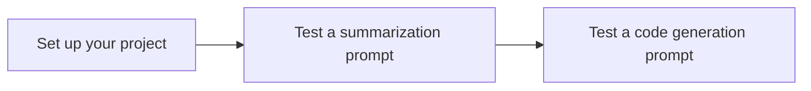

# Quickstart: Send text prompts to Gemini using Vertex AI Studio

You can use Vertex AI Studio to design, test, and manage prompts for Google's [Gemini](../express-mode/overview.md) large language models (LLMs) and third-party models. Vertex AI Studio supports certain third-party models that are offered on Vertex AI as models as a service (MaaS), such as Anthropic's Claude models and Meta's Llama models.

> **Note:**
> On your initial use for third-party models, Vertex AI prompts you to accept the third-party's terms and conditions. You must do this once for each third-party provider to start using their models.

In this quickstart, you will:

*   Send a summarization text prompt to the Gemini API using a sample from the prompt gallery.
*   Send a code generation prompt to the Gemini API using a sample from the prompt gallery.
*   View the code used to generate the responses.

## 📚 Before you begin

This quickstart requires you to complete the following steps to set up a Google Cloud project and enable the Vertex AI API.

???+ "Steps to set up your project"

    1.  Sign in to your Google Cloud account. If you're new to Google Cloud, [create an account](https://console.cloud.google.com/freetrial) to evaluate how our products perform in real-world scenarios. New customers also get $300 in free credits to run, test, and deploy workloads.

    2.  In the Google Cloud console, on the project selector page, select or create a Google Cloud project.

        > **Note**: If you don't plan to keep the resources that you create in this procedure, create a project instead of selecting an existing project. After you finish these steps, you can delete the project, removing all resources associated with the project.

        [Go to project selector](https://console.cloud.google.com/projectselector2/home/dashboard){: .md-button}

    3.  Make sure that billing is enabled for your Google Cloud project.

    4.  Enable the Vertex AI API.

        [Enable the API](https://console.cloud.google.com/flows/enableapi?apiid=aiplatform.googleapis.com){: .md-button}

!!! tip "Troubleshooting"
    If you encounter issues with code snippets or setup, refer to the [Troubleshooting Guide](https://cloud.google.com/vertex-ai/docs/general/troubleshooting?component=any).

## 📚 What are prompts?

A prompt is a natural language request submitted to a language model to generate a response. Prompts can contain questions, instructions, contextual information, few-shot examples, and partial input for the model to complete. For example, a prompt could be `"Summarize the following article in three sentences:"` followed by the article text.

After the model receives a prompt, depending on the type of model used, it can generate text, embeddings, code, images, videos, music, and more.

The sample prompts in the Vertex AI Studio prompt gallery are pre-designed to help demonstrate model capabilities. Each prompt is preconfigured with specified model and parameter values so you can open the sample prompt and click **Submit** to generate a response.

## ⚙️ Test the Gemini model with sample prompts

You can test the Gemini model's capabilities by sending it different types of prompts from the prompt gallery.

???+ "Test a summarization prompt"
    

    Send a summarization text prompt to the Vertex AI Gemini API. A summarization task extracts the most important information from text. You can provide information in the prompt to help the model create a summary, or ask the model to create a summary on its own.

    1.  Go to the **Prompt gallery** page from the Vertex AI section in the Google Cloud console.

        [Go to prompt gallery](https://console.cloud.google.com/vertex-ai/studio/prompt-gallery){: .md-button}

    2.  In the **Tasks** drop-down menu, select **Summarize**.

    3.  Open the **Audio summarization** card. This sample prompt includes an audio file and requests a summary of the file contents in a bulleted list.

        <figure style="text-align: center;">
          
          <figcaption>The audio summarization prompt text and audio file.</figcaption>
        </figure>

    4.  Notice that in the settings panel, the model's default value is set to **Gemini-2.0-flash-001**. You can choose a different Gemini model by clicking **Switch model**.

        <figure style="text-align: center;">
          
          <figcaption>The Gemini model in the settings panel.</figcaption>
        </figure>

    5.  Click **Submit** to generate the summary. The output is displayed in the response.

        <figure style="text-align: center;">
          
          <figcaption>The Submit button in the Prompt box.</figcaption>
        </figure>

    6.  To view the Vertex AI API code used to generate the transcript summary, click **Build with code** > **Get code**. In the **Get code** panel, you can choose your preferred language to get the sample code for the prompt, or you can open the Python code in a Colab Enterprise notebook.

???+ "Test a code generation prompt"
    

    Send a code generation prompt to the Vertex AI Gemini API. A code generation task generates code using a natural language description.

    1.  Go to the **Prompt gallery** page from the Vertex AI section in the Google Cloud console.

        [Go to prompt gallery](https://console.cloud.google.com/vertex-ai/studio/prompt-gallery){: .md-button}

    2.  In the **Tasks** drop-down menu, select **Code**.

    3.  Open the **Generate code from comments** card. This sample prompt includes a system instruction that tells the model how to respond and some incomplete Java methods.

        <figure style="text-align: center;">
          
          <figcaption>The code generation prompt text.</figcaption>
        </figure>

    4.  Notice that in the settings panel, the model's default value is set to **Gemini-2.0-flash-001**. You can choose a different Gemini model by clicking **Switch model**.

        <figure style="text-align: center;">
          
          <figcaption>The Gemini model in the settings panel.</figcaption>
        </figure>

    5.  To complete each method by generating code in the areas marked `<WRITE CODE HERE>`, click **Submit**. The output is displayed in the response.

    6.  To view the Vertex AI API code used to generate the code, click **Build with code** > **Get code**. In the **Get code** panel, you can choose your preferred language to get the sample code for the prompt, or you can open the Python code in a Colab Enterprise notebook.

## 🔗 What's next?

*   See an introduction to prompt design.
*   Learn about designing multimodal prompts and chat prompts.