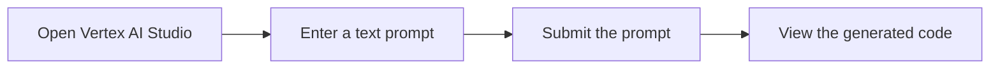

# Try it: Send a text prompt to Gemini without an account using Vertex AI Studio

In this quickstart, you use Vertex AI Studio to send a prompt to the Gemini API without needing to register for a Google Cloud account. Vertex AI Studio provides a user-friendly interface to design, test, and manage prompts for Google's Gemini large language model (LLM).

In this quickstart, you will:

*   Send a freeform text prompt to the Gemini API.
*   View the code used to generate the response.

## 📚 Compare Vertex AI Studio access options

You can access Vertex AI Studio in several ways, each with different features and limitations. While access to freeform text prompts is available without a Google Cloud account, some features require a free trial or a full account.

To begin, accept the Vertex AI Studio Terms of Service in the Google Cloud console. The following table compares the features available for each access method.

| Feature | Without a Google Cloud account | With a Google Cloud free trial account | With an existing Google Cloud account |
|---|---|---|---|
| **Sign in required** | No | Yes | Yes |
| **Queries per minute (QPM)** | 2 QPM for all multimodal models | See [quota limits](https://cloud.google.com/vertex-ai/docs/quotas) | See [quota limits](https://cloud.google.com/vertex-ai/docs/quotas) |
| **Credits offered** | $0 | Up to $300 for 90 days | $0 |
| **Prompt gallery** | No | Yes | Yes |
| **Prompt designer** | Yes | Yes | Yes |
| **Save prompts** | No | Yes | Yes |
| **Prompt history** | No | Yes | Yes |
| **Advanced parameters** | No | No | Yes |
| **Tuning** | No | No | Yes |
| **API usage** | No | Yes | Yes |
| **Billing required** | No | No | Yes |
| **How to get started** | [Go to Vertex AI Studio](https://console.cloud.google.com/vertex-ai/generative/multimodal/create/text) | [Sign up for a free trial](https://console.cloud.google.com/freetrial?redirectPath=/vertex-ai/generative) | [Try Vertex AI Studio in your console](https://console.cloud.google.com/vertex-ai/generative) |

This quickstart provides instructions for accessing Vertex AI Studio without an account. You can also complete this quickstart using the free trial or an existing account.

## 📚 What is a prompt?

A prompt is a natural language request that you send to a large language model to elicit a response. A well-crafted prompt can contain questions, instructions, contextual information, and examples to guide the model toward the desired output. After the model receives a prompt, it can generate text, code, images, and more, depending on the model's capabilities.

For example, a simple prompt could be a direct question:
`What are the top 5 largest cities in the world by population?`

A more complex prompt might include instructions and context:
`Generate three creative taglines for a new coffee shop that specializes in artisanal, single-origin beans. The tone should be modern and sophisticated.`

## ⚙️ Test Gemini with a text prompt

Vertex AI Studio lets you test text and multimodal prompts using a variety of Gemini models. In this section, you'll create a text prompt that asks the model to generate names for a flower shop.

???+ "Steps to test Gemini with a text prompt"

    **1. Open Vertex AI Studio**
    

    Navigate to Vertex AI Studio and click **Create prompt**.

    [Open Vertex AI Studio](https://console.cloud.google.com/vertex-ai/studio/multimodal){: .md-button}

    **2. Enter a text prompt**
    

    In the prompt box, enter the following text:

    `What are some possible names for a flower shop that sells bouquets of dried flowers?`

    **3. Submit the prompt**
    

    Click **Submit**. The model's output appears in the **Response** box.

    **4. View the generated code**
    

    To view the Vertex AI API code used to generate the response, click code**Get code**. In the **Get code** panel, you can choose your preferred programming language to see the corresponding code sample.

    !!! tip "Troubleshooting"
        If you encounter issues with code snippets or setup, refer to the [Troubleshooting Guide](https://cloud.google.com/vertex-ai/docs/general/troubleshooting?component=any).

    > **Note:**
    > Opening the sample Python code in a Colab Enterprise notebook is not available without a Google Cloud account.

## 🔗 What's next

*   See an [introduction to prompt design](https://cloud.google.com/vertex-ai/docs/generative-ai/learn/introduction-prompt-design).
*   Learn about designing [text prompts](https://cloud.google.com/vertex-ai/docs/generative-ai/design/text-prompts) and [text chat prompts](https://cloud.google.com/vertex-ai/docs/generative-ai/design/chat-prompts).
*   Learn about [streaming responses from a model](https://cloud.google.com/vertex-ai/docs/generative-ai/start/quickstarts/api-quickstart#gemini-stream-multimodality).